# User Manual — Tracker Porti

> 🇮🇹 Manuale in italiano: [manuale.md](manuale.md) · [index.html](index.html)

Complete guide to using **Tracker Porti** as an end user. Explains what you can do and how to do it, screen by screen.

> This manual covers day-to-day use of the application. Administration functions (user management, roles, system logs) are not covered here.

---

## What is Tracker Porti

**Tracker Porti** monitors AIS ship traffic in real time over one or more geographic areas of your choice. It collects the data ships broadcast via AIS, analyzes it, computes a **risk score** for every vessel, and presents it all on interactive maps and tables.

You can:

- **monitor several ports/areas** at once, each with its own data stream;
- **see current ships**, **past ships**, and **traffic statistics**;
- **follow individual ships** wherever they go, even outside monitored areas;
- consult the **full detail** of every ship (identity, route, sanctions, suspicious behavior…);
- **receive notifications** in-app and on Telegram for relevant events;
- **export** data (CSV, GeoJSON, KML) and take **backups**.

No technical knowledge is required to use it.

---

## Quick start

1. Open your browser at the server address (e.g. `http://localhost:3000`).
2. **Log in** with your credentials (see [Account and access](#account-and-access)).
3. In the left sidebar, choose the **area** to display from the **Area:** dropdown.
4. Press **▶ Start monitoring** to start receiving data for that area.
5. Ships appear automatically on the map and in the table.

---

## Account and access

The application is protected by **login**: you must authenticate to use it. Each user has their own data (areas, followed ships, notifications, settings), separate from other users'.

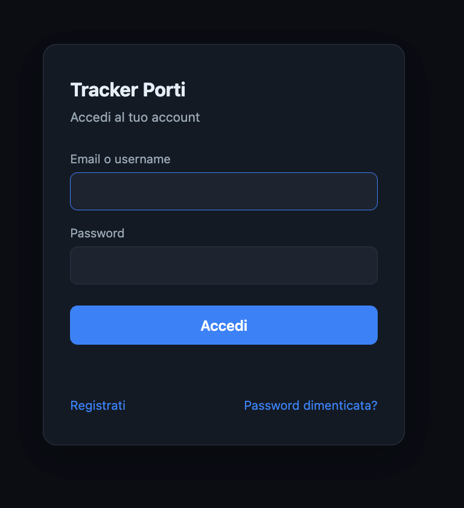

### Registering

From the login page, follow the **Register** link and enter **first name, last name, email, and password**. The new account is created in a *"pending"* state: you'll be able to log in **only after an administrator approves it**. Once approved, log in normally.

### Logging in

On the login page, enter your password and, as identifier, **either your username or your email** (both work). The session stays valid for several days: normally you don't need to re-enter your credentials on every visit.

> After too many failed attempts in a short time (10 in 15 minutes), login is **temporarily blocked** for a few minutes, as anti-bot protection. Wait and try again.

### Logging out

Use the account widget **top right** and choose **Log out**.

### Forgot password

The login page has a **Forgot password?** link. Email delivery is not currently active: to reset your password, **contact an administrator**, who will generate a **one-time link** (valid 24 hours) for you to set a new one.

### Your data

Each user has their **own**:

- monitoring **areas**;
- **settings** (notification preferences, map options, language, default area);
- **flagged ships** ★ and **followed ships**;
- **notifications**.

You see the AIS data of ships located **inside your areas**. Enrichment sources (VesselFinder, MarineTraffic, sanctions, etc.) and the risk-score configuration are instead **shared** and managed by administrators.

> If an administrator puts you in a **user group**, some things (areas, followed/flagged/muted ships, notification and map preferences) are **shared with the other members**: what you add shows up for them and vice versa. Your **Telegram link** and interface **language** stay personal.

---

::: {.tutorial}

## 🚀 First steps (tutorial) {#tutorial}

**Just logged in for the first time? Start here.** This quick guide walks you from the first things to do — defining an area, starting monitoring, searching for and following a ship — to the rest of the app. Every step links to the detailed section further in the manual. Once done, you're operational; the rest of the manual is reference material.

### Step 1 — Define your first area

An **area** is the geographic box you want to watch (a port, a stretch of sea). On first login you may not have one yet.

1. In the sidebar, press **🗺 Areas**.
2. Give the area a **name** (e.g. "Port of Bari").
3. Define the boundaries the easy way: pan and zoom the map until it frames the zone, then press **🎯 Capture current view** (or enter the SW and NE coordinates by hand).
4. Press **＋ Add area**: the area is saved and immediately starts receiving data.

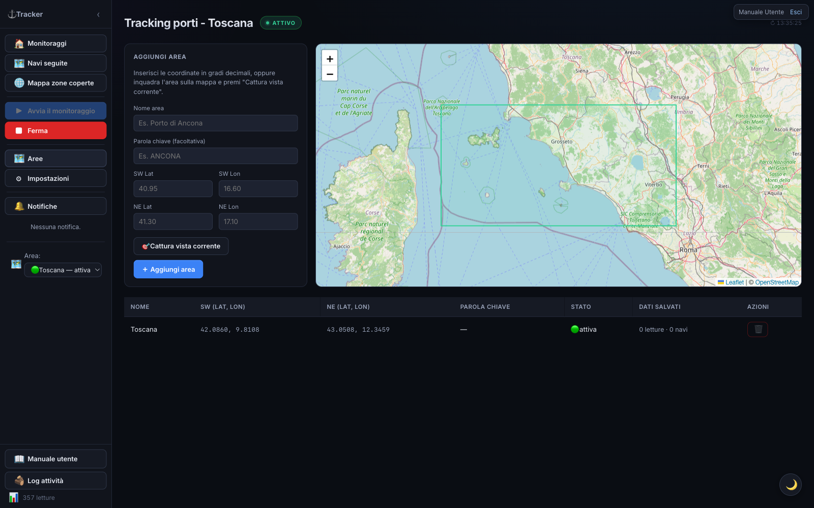

→ Full details in [Managing areas](#managing-areas).

### Step 2 — Start monitoring and watch the ships

1. Go back to monitoring with **🏠 Monitoring**.
2. Select the area in the **Area:** dropdown at the bottom of the sidebar.
3. Press **▶ Start monitoring**: the **● ACTIVE** badge appears at the top.
4. Within a short time, ships appear on the **map** (colored by risk) and in the **table** below. Click a row to open the ship's **detail**.

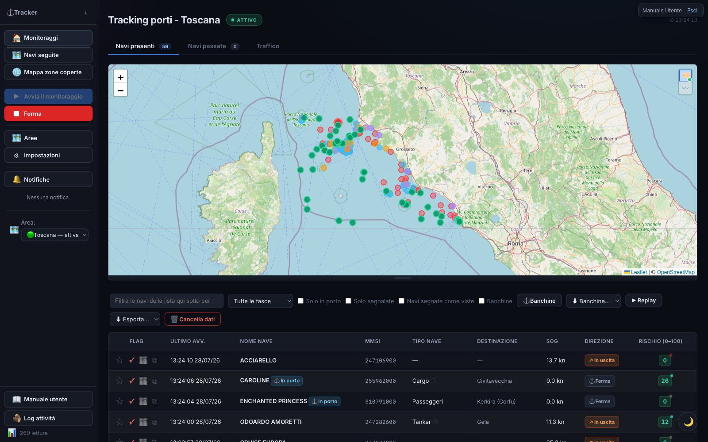

→ Details in [The three main tabs](#the-three-main-tabs) and [Ship detail](#ship-detail).

### Step 3 — Search for and follow a ship

**Followed ships** are ships you keep an eye on wherever they go, even outside your areas.

1. Sidebar → **🗺 Followed ships**.
2. In the search bar, type the ship's **name** or **MMSI** and press **🔍 Search**.
3. Wait for the results window to fetch identity and **live position** (up to ~90s).
4. When **🗺 Follow ship** becomes enabled, press it: the ship is added to your followed list.

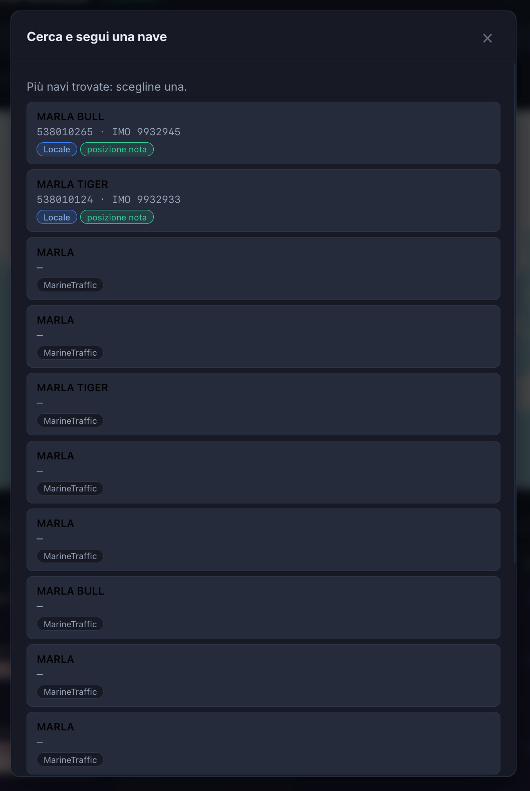

→ Details in [Followed ships](#followed-ships).

### Step 4 — Customize (optional)

- **★ Flag** a ship to highlight it; **✓ Seen** to mark ones you've already checked.
- Turn on **🔔 Notifications** (ship return, high score, etc.) and, if you want, link **Telegram**.
- Switch light/dark **theme** with the 🌙 / ☀️ button, bottom right.

→ See [Notifications](#notifications) and [Settings](#settings).

**That's all it takes to get started.** From here the manual goes into the detail of every feature.

:::

---

## Main interface

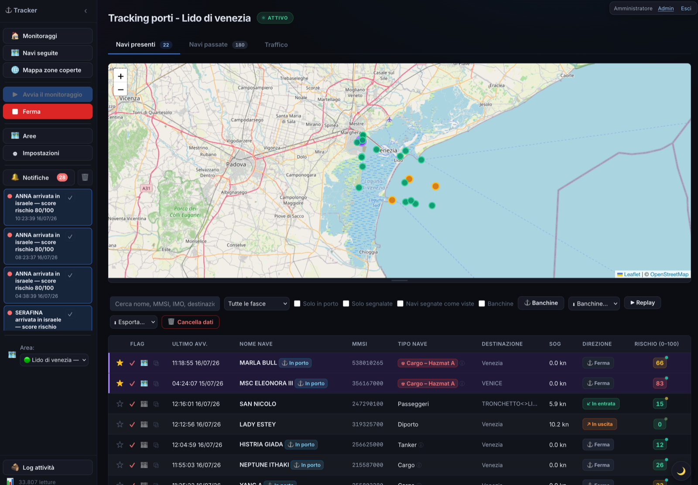

### Sidebar (left)

| Element | Function |
|---|---|
| **🏠 Monitoring** | Return to the home (Current / Past ships / Traffic tabs) |
| **▶ Start monitoring** | Starts real-time AIS data reception for the displayed area |
| **■ Stop** | Stops reception for the current area (already-collected data stays) |
| **🗑 Clear data** | Deletes the readings for the displayed area — **irreversible** |
| **🗺 Areas** | Area management: list, map, add and remove (see [Managing areas](#managing-areas)) |
| **🌐 Coverage map** | World map of AIS coverage (see [Coverage map](#coverage-map)) |
| **⚙ Settings** | App settings, including technical tabs |
| **🔔 Notifications** | Shows/hides the notification list; a red badge counts unread ones |
| **Area:** | Selects the zone to display. Doesn't start or stop the stream — each area has its own. 🟢 = stream active, ⚪ = off |
| **N readings** | Counter at the bottom: positions received during the session |

### Status bar (top)

The **● ACTIVE** badge (pulsing green dot) indicates the displayed area's stream is running. **INACTIVE** means reception for that area is stopped.

### Theme switch

The **🌙 / ☀️** button bottom right toggles dark (default) and light theme.

---

## The three main tabs

The home shows three tabs: **Current ships**, **Past ships**, and **Traffic**.

### 1. Current ships

Ships detected in the area over the last few hours, with a real-time map and table.

**Map:** ships are markers colored by risk band. You can drag the map's bottom edge to resize it.

**Table — columns:**

| Column | Meaning |
|---|---|
| Action icons | Flag ★, mark as seen ✓, open on VesselFinder ⧉ |
| Last seen | Date and time of the last position received |
| Ship name | Name of the vessel |
| MMSI | Unique identification code |
| Ship type | Category (cargo, tanker, passenger…) |
| Destination | Declared port. UN/LOCODE codes (e.g. `ITTAR`) are resolved to the port name (e.g. "Taranto") |
| SOG | Speed over ground (knots) |
| Direction | ↙ Inbound / ↗ Outbound / ⚓ Stationary |
| Risk (0–100) | Score (green/yellow/red) |

**Sorting:** click a column header to sort; a second click reverses the order (▲/▼). Sort order persists across automatic refreshes.

**Per-row buttons:**

- **☆ / ★ Flag** — highlights the ship in purple as "to review". Click again to remove.
- **✓ Seen** — marks the ship as already reviewed (the row is dimmed). Useful for not missing new arrivals.
- **⧉ VesselFinder** — opens the ship's page on the VesselFinder site.

**Row colors:**

| Color | Meaning |
|---|---|
| Red 🪖 | Military ship (auto-flagged) |
| Red | High risk score (71–100) |
| Purple | Manually flagged ship |
| Dimmed | Ship marked as "seen" |
| Badge ⚓ In port | Ship currently moored |

**Click a row** to open the [full detail](#ship-detail).

**Filters (bar above the table):** search by name/MMSI/IMO/destination, filter by risk band, **In port only**, **Flagged only**, **Ships marked as seen**, and the **Berths** checkbox for the mooring overlay. On the right: **⚓ Berths**, **⬇ Export…**, and **▶ Replay** buttons.

#### Berths (automatic mooring characterization)

Turning on the **Berths** overlay shows where ships dock and what type they are, learned automatically.

**How it works:**

1. **Mooring detection** — every time a ship stops in port, the system records a mooring point (centroid of the stationary ship's positions in the area).
2. **Grouping** — nearby points are grouped into **berths** (the outline is the envelope of the group's points).
3. **Characterization** — for each berth, ship categories are counted. When one category exceeds **60%** of moorings (out of at least **10** moorings), the berth is **colored** with that category; below the threshold it's **"mixed"** (grey). With fewer than 10 moorings it stays dashed.

**Using the overlay:**

- Check **Berths** in the filter bar to show/hide it (the choice is remembered).
- Every berth has a colored polygon and an always-visible **center dot**.
- **Click a berth** to see its name, characterization, number of moorings, breakdown by category, breakdown by cargo type, and any share of dangerous goods (☢).

**Manual correction** (**⚓ Berths** button): opens the management panel, where you can **rename**, **force the category**, **merge** several berths, **delete** a berth, or **recompute** right away. Clicking a list row centers the map on that berth.

> Berths edited by hand (geometry, name, forced category) **survive automatic recomputation**: manual corrections are never overwritten.

**OpenSeaMap overlay.** In settings (→ General, on by default) there are two independent switches: the **Nautical layer (tile)** draws OpenSeaMap nautical symbols (buoys, lighthouses, lights, signals, anchorages) as a single image; **Markers (selectable)** draws ⚓ markers for moorings/berths/official ports from OpenStreetMap, filterable by category. The data is free (no API key) and coverage in commercial ports may be incomplete.

#### Historical replay (reviewing past traffic)

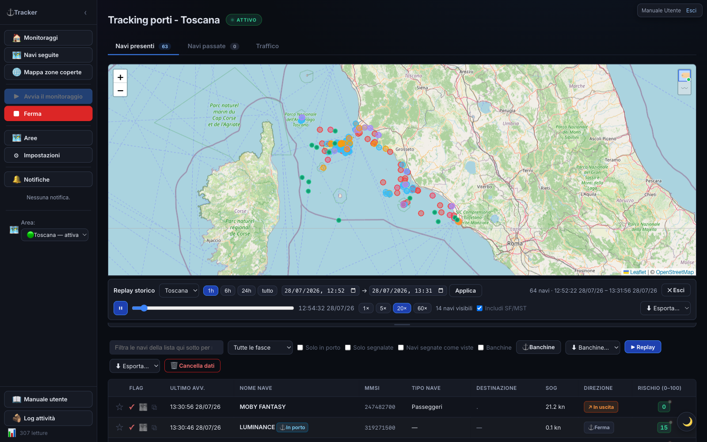

The **▶ Replay** button replays how traffic in the area moved during a past interval. In replay mode, live markers are hidden and a control bar appears:

- **Area** — which of your areas to replay.
- **Window** — presets **1h / 6h / 24h / all**, or a **custom** interval. It automatically snaps to the most recent available data.
- **▶ / ⏸**, the **scrubber**, and **speeds** (1× / 5× / 20× / 60×).

Each ship moves interpolated between its real positions, leaves a **fading trail**, and is colored by risk; click it for detail. During a **signal gap**, the ship is **hidden** instead of "teleporting". Press **✕ Exit** to return to live.

> If you have the ShipFinder/MyShipTracking integrations enabled, an **Include SF/MST** toggle appears (on by default), which also uses those positions to fill in stretches where AIS is silent.

### 2. Past ships

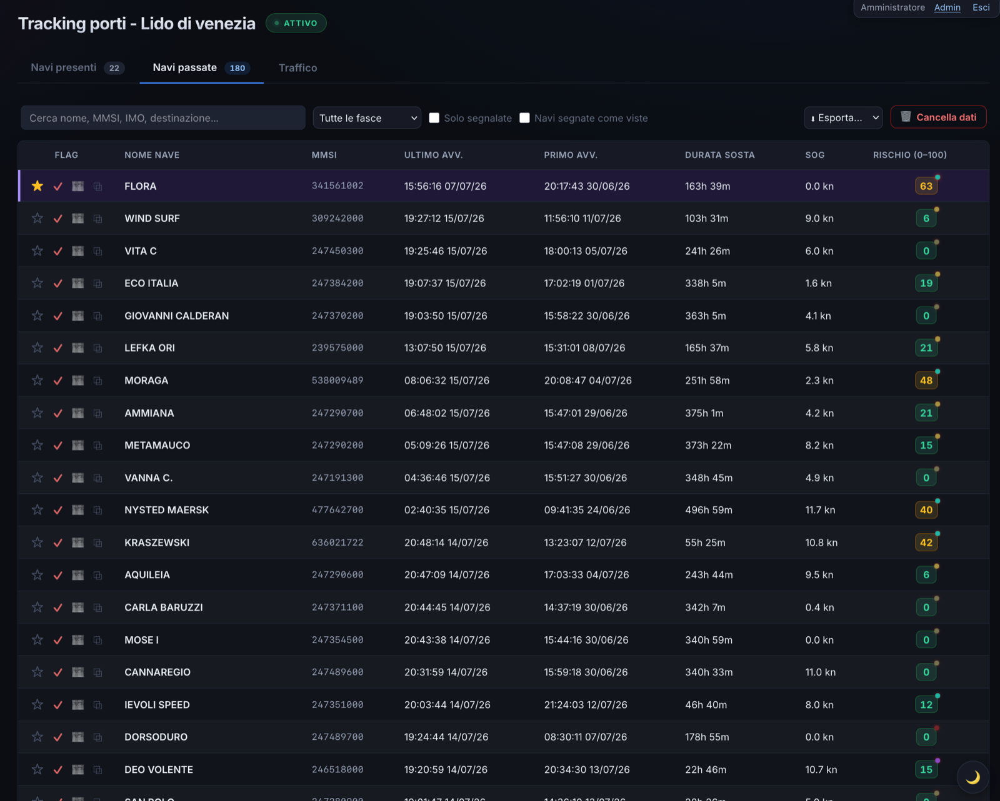

Ships that previously visited the area. Table similar to "Current ships", plus:

- **First contact** — when the ship was first seen;
- **Stay duration** — how long it remained in the area.

Column sorting works as in current ships.

### 3. Traffic

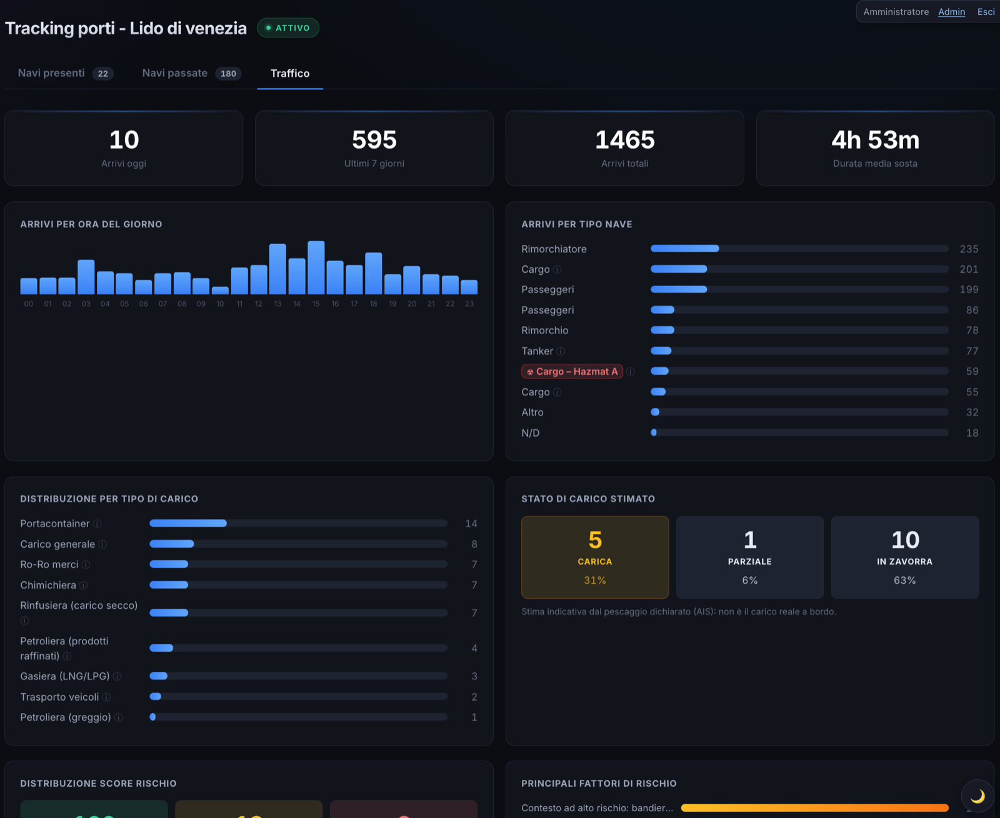

Statistics panel with aggregate indicators and charts.

**Tiles at the top:** Arrivals today · Arrivals last 7 days · Total arrivals · Average stay duration.

**Charts:**

| Chart | What it shows |
|---|---|
| Arrivals by hour of day | Hourly bars (00–23) |
| Arrivals by ship type | Ships per category |
| Risk score distribution | Breakdown low/medium/high |
| Top risk factors | Which factors weigh the most |
| Daily arrivals (last 30 days) | Trend over the month |
| Highest-scoring ships | The riskiest vessels |

**Bottom panels:** **Expected ships** (heading toward the area, matched by keyword in the destination) and **Latest port events** (recent arrivals/departures).

---

## Followed ships

The **🗺 Followed ships** section collects ships you follow **wherever they go**, even outside monitored areas, via a dedicated AIS stream. A followed ship that drops off AIS coverage **is not lost**: it stays hooked to a worldwide re-acquisition net and is tracked again as soon as it re-transmits.

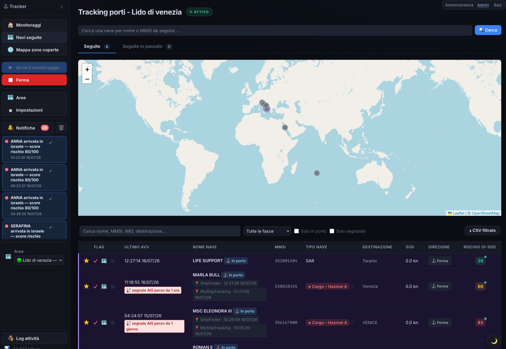

Two sub-tabs: **Followed** (currently tracked) and **Previously followed** (history; a ship ends up here only after a very long silence — default ~6 months — or when you stop following it).

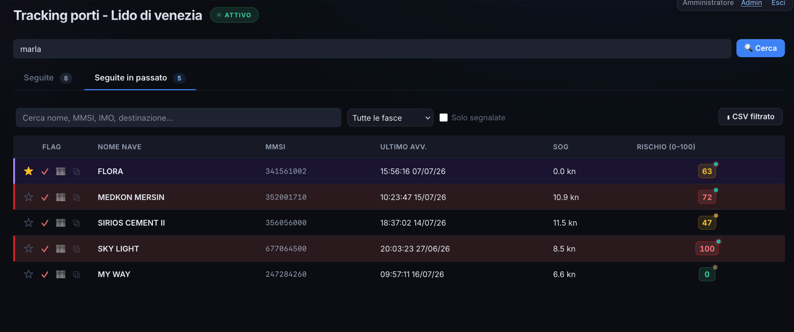

### Searching for and following a ship

At the top of the section there's a **search bar**: type **name** or **MMSI** and press **🔍 Search**.

1. A results window opens that stays open while we gather data. If the name matches several ships, pick the right one.
2. The card fills in **progressively**: identity and data from VesselFinder / MarineTraffic / Global Fishing Watch (with an icon showing where it was found), any **sanctions** or **PSC** alerts, and the **live position** on a mini-map.
3. The position is fetched in real time from AISstream: it can take up to ~90s. If the ship isn't transmitting, a warning with **↻ Retry** appears.
4. When the position is available, **🗺 Follow ship** becomes enabled: click it to add it to your followed list.

Closing the window (**Cancel**, **✕**, clicking outside, or **Esc**) stops the search without following anything.

### Re-following a ship from "Previously followed"

When you re-follow a ship that was in **Previously followed** (open its detail and press **🗺 Follow ship**), the app **immediately** puts it back among the followed ones and starts searching for its position in the background:

- if the ship is transmitting, it stays among the followed ones and the position updates;
- if it does **not** transmit within ~90 seconds, it **goes back to "Previously followed"** and you get a **notification** that it wasn't found.

---

## Ship detail

Clicking any table row (or a ship's notification) opens the full detail card.

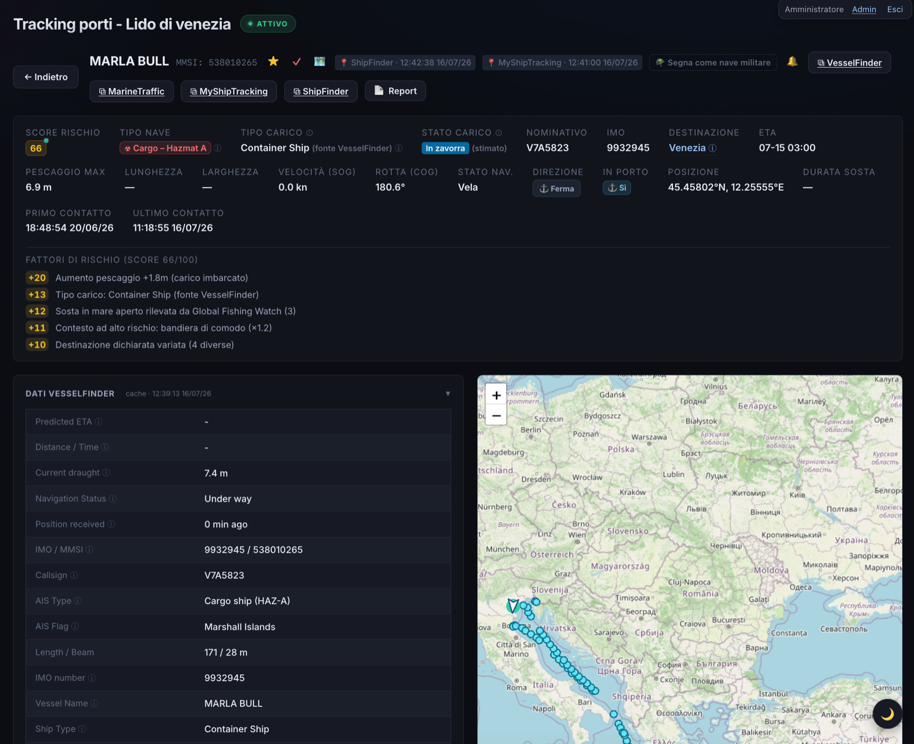

### Header and actions

- **← Back** — return to the list
- **★ Flag** / **✓ Seen** — flag / mark as reviewed
- **🪖 Mark as military ship** — classifies the ship as military (red row, maximum risk)
- **🔔 / 🔕** — mute or re-enable automatic notifications for this ship
- **⧉ VesselFinder / MarineTraffic / ShipFinder / MyShipTracking** — open the external page
- **Report** — generates a report for the ship

### Information grid

All available data for the ship:

| Field | Meaning |
|---|---|
| Risk score | Colored badge 0–100 |
| Ship type | Category; "☢ Hazmat" if carrying dangerous goods |
| Cargo type | Cargo class (container ship, tanker, chemical tanker, gas carrier, bulk carrier…) with source in parentheses |
| Load status | Estimated laden / partial / ballast from declared draught |
| Call sign | Radio call sign |
| IMO | IMO registration number |
| Destination | Declared port |
| ETA | Estimated time of arrival |
| Max draught | Hull depth in water (m) |
| Length / Beam | Physical dimensions |
| SOG / Course | Current speed and heading |
| Nav status | Moored, underway, etc. |
| Direction | Inbound / outbound / stationary |
| Position | Last latitude and longitude |
| Stay duration | Time elapsed since arrival |
| First / Last contact | Timestamp of the first and last data received |

### Risk factors

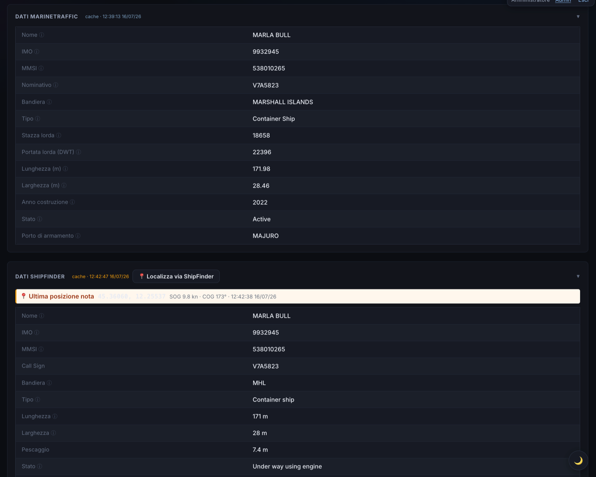

List of the factors that contributed to the score, with each one's points. If there are no anomalies, "No anomalies detected" is shown.

### VesselFinder / MarineTraffic data

If enabled in settings, shows additional information fetched from these services (flag, gross tonnage, year built…), noting whether it's cached. Fetching happens automatically in the background for recently seen ships.

### ShipFinder and MyShipTracking data (re-locating followed ships)

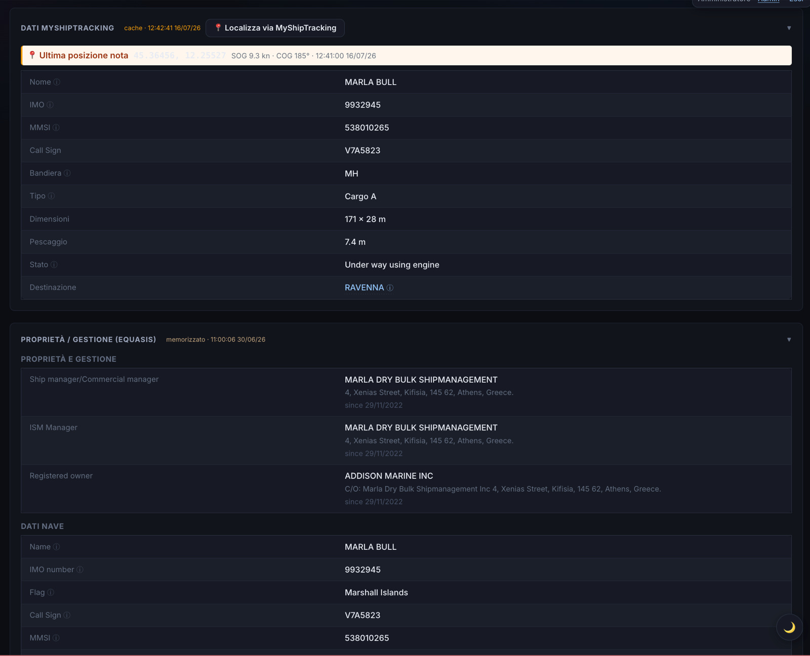

If you enable **Import ShipFinder** and/or **Import MyShipTracking**, the corresponding panels appear. Besides static data, these sources provide the **last-sighting position**, used to **re-locate followed ships AIS can no longer see**:

- **Automatic** — for every followed ship that hasn't transmitted in a while, the app periodically queries these sources in the background. If it finds a position, it appears on the mini-map as a distinct marker (**orange** = ShipFinder, **teal/cyan** = MyShipTracking), without altering the AIS track, score, or replay.
- **Dedicated badge** — when a position exists, a **📍 seen on ShipFinder/MyShipTracking · <date>** badge appears next to the name, distinct from the yellow **🔍 searching** badge (which reflects AIS status). The "searching" badge only turns off with a real AIS signal.
- **Manual** — the **📍 Locate via ShipFinder / MyShipTracking** button fetches the current position **right away**.

> The panels appear **only if the integration is enabled** (Settings → Import…). Off by default. On the Followed ships map, a ship AIS can no longer see is shown at its most recent SF/MST position (grey marker) and returns to live AIS as soon as it re-transmits.

### Ownership / management (Equasis)

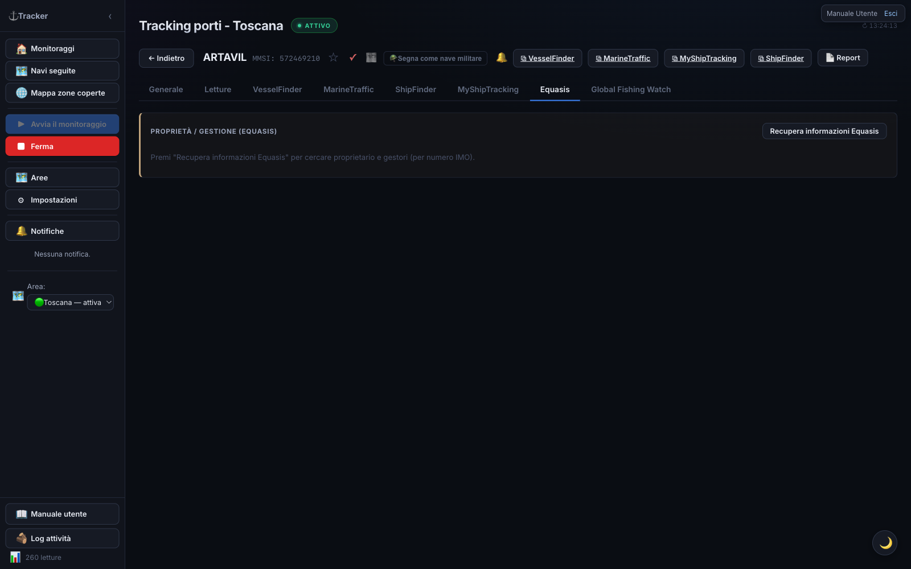

If the Equasis lookup is enabled, the **Ownership / management (Equasis)** panel appears with a **Fetch Equasis information** button. **Never runs automatically**: the lookup only happens on click and queries Equasis by **IMO number**. It returns ship data, **ownership and management** (owner, ISM manager, operator), classification, P&I coverage, performance/risk indicators, and recent positions. The result is stored once and shown with no expiry.

### Global Fishing Watch

If GFW enrichment is enabled (on by default), the **Global Fishing Watch** panel appears with the ship's **identity** and tables of **behavioral events** derived from the global AIS feed:

- **Encounters** — two ships meeting in open water (a transshipment signature).
- **Loitering** — prolonged stop in open water.
- **Port visit** — reconstructed port calls.
- **AIS off (gap)** — transponder off while underway ("dark activity").

Enrichment is **proactive** (no button). GFW mainly tracks fishing, support, and reefer/carrier vessels: many merchant ships aren't present (a "not found in GFW" note). These events **feed the risk score**.

### Sanctions

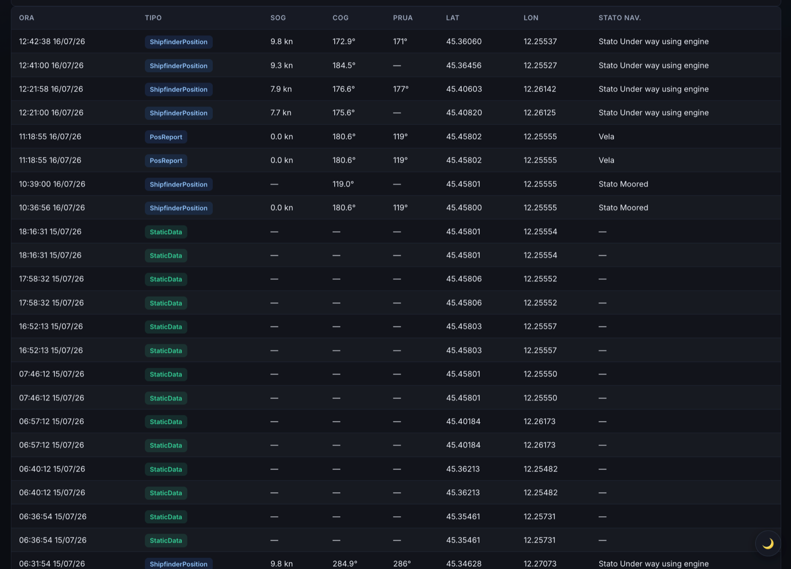

When a ship matches a sanctions list, the **Sanctions** panel appears at the top of the detail — with a red border:

- **List** — the matching regime: OFAC SDN (USA), EU consolidated list, UK OFSI, or UN.
- **Programme** — the specific sanctions programme, if available.
- **Matched by** — the field the match was made on: **IMO** or **call sign** (high confidence) or **name** (weaker, possible homonym).
- **Listed name**, **flag**, **owner**, and **aliases** of the entity, when available.

A notice reminds you to always verify against the official source (a **name-only** match can be a false positive). When an identifier is available, **Open official profile** opens the public page. The panel appears **only** for listed ships.

### Rendezvous at sea

If the ship has had a confirmed **rendezvous** with another one (stayed close, slow, and offshore long enough — a ship-to-ship transshipment signature), the **Rendezvous at sea** section appears with the list of encounters (other ship, date/time, minimum distance, area). Every row is clickable and opens the ship involved. A confirmed rendezvous triggers a **notification** and **adds risk points to both** ships.

### Position map

Map with the ship's track and animated playback controls.

- **Time window** — presets **6h / 24h / 7d / all**, or a **custom** interval (From → To, then **Apply**).
- **▶ / ⏸** — plays/pauses the track animation.
- **Scrubber** — jumps to any point on the track.
- **Speed** — **1× / 5× / 20× / 60×** (default 20×), changeable during playback.
- **Include SF/MST** — if the integrations are active and the ship has scraped positions, includes them in the track (amber nodes = ShipFinder, teal = MyShipTracking).

> The **last known position** markers for ShipFinder/MyShipTracking shown on the map follow the **same time window** selected for the track (preset, custom interval, or replay segment): narrowing the window only shows sightings that fall within it, exactly as with AIS positions. The **📍 Locate via …** button always shows the just-fetched position regardless.

### AIS readings

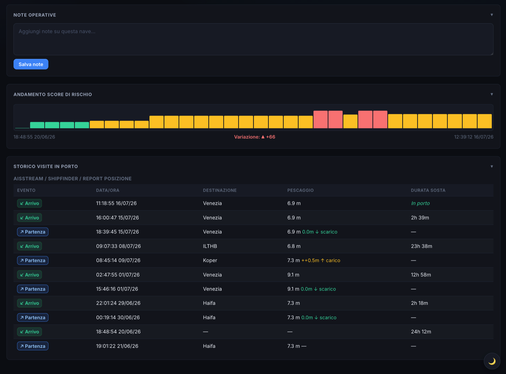

Paginated table with all positions received in chronological order. Click a row for detail. Full raw JSON data is shown only for static messages (name, dimensions, destination…); for simple position messages, the useful fields are already in the grid. Navigate with **← Prev** and **Next →**.

### Operational notes

Free-text area: write any notes about the ship and press **Save notes**. Notes are persisted in the database.

### Port visit history

Log of all arrivals (↙) and departures (↗) detected for the ship, with destination, draught, and stay duration. UN/LOCODE codes in the destination are resolved to the port name (e.g. `ITNAP` → "Napoli").

---

## Managing areas

Open with **🗺 Areas**. Here you add and remove monitored areas **without restarting the app**.

The screen contains:

- an **"Add area" panel** (top left);
- a **map** with all areas as rectangles (green = stream active, purple = area in view, blue = others);
- a **table** with name, SW and NE coordinates, keyword, stream status, saved data, and delete button.

### Adding an area

1. Write a **name** (required) and, if you want, a **keyword** (for the "Expected ships" filter).
2. Specify the boundaries in **one** of two ways:
   - **GPS coordinates** — enter by hand the latitude and longitude in **decimal degrees** of the two SW (South-West) and NE (North-East) corners. E.g.: SW `40.95, 16.60` — NE `41.30, 17.10`. A preview rectangle appears as you type.
   - **From map** — frame the area by panning/zooming the map, then press **🎯 Capture current view**: the coordinates fill in on their own.
3. Press **＋ Add area**. The area is saved and its stream starts immediately.

> Latitude ranges from -90 to 90 (positive to the North), longitude from -180 to 180 (positive to the East). Corners can be entered in any order: they are automatically reordered.

### Removing an area

Press 🗑 on the area's row. **Removing the area also deletes all related history** (readings, ships, and port events). For safety, deletion **is not immediate**: a warning appears with a countdown and an **↶ Undo** button for **10 seconds**. It becomes final when the time expires or when you leave the Areas page.

> **At least one area** must remain: the delete button is disabled when only one is left.

---

## Coverage map

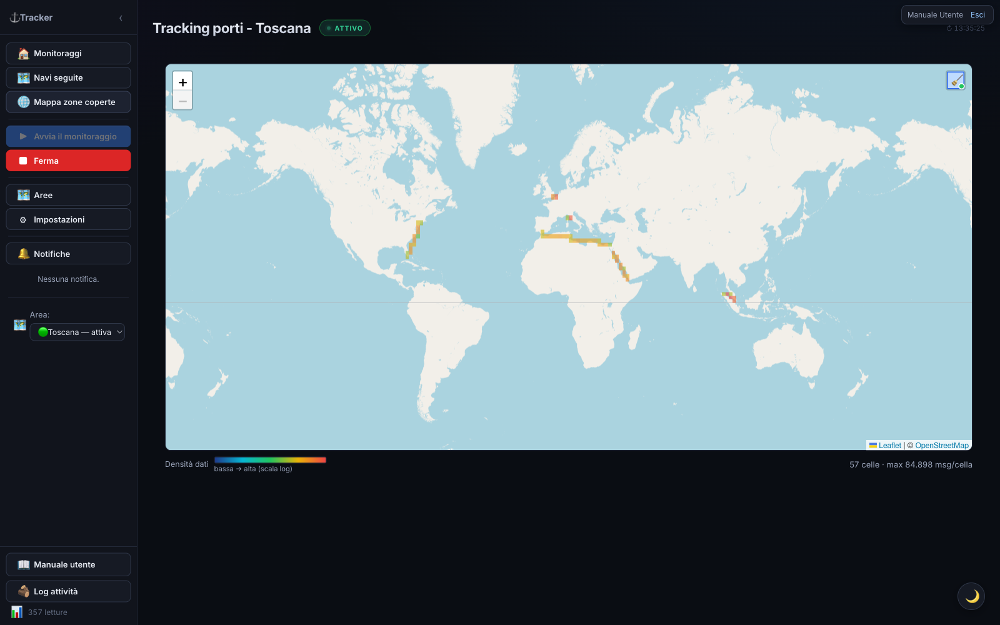

Opens from **🌐 Coverage map**. Shows a **world map** where each cell is colored according to **how many AIS messages are received** in that zone: from **blue** (few) to **red** (many). Useful for seeing at a glance where AIS coverage is good and where there are "holes".

As a user, you can **open the map and see the current data** (read-only for you). The map is also available **without login** at `/heatmap`. Starting and stopping data collection is reserved to administrators.

---

## Settings

Open with **⚙ Settings**. Settings are organized into **tabs**: **General**, **Areas**, **External integrations**, **Parameters**, **Backup / Restore**, and the technical **📡 AIS Diagnostics** tab.

### General tab

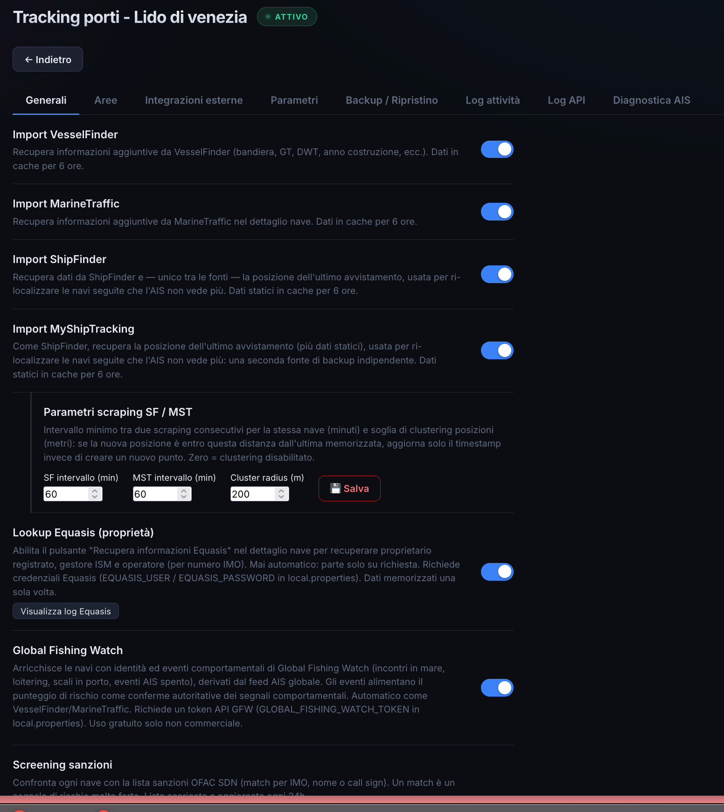

At the top, the **Area monitoring** panel shows all areas with a toggle to start/stop each one's stream (🟢 active / ⚪ off): this way you monitor several areas together.

Below, the toggles for **data sources and features**:

| Option | Function |
|---|---|
| **VesselFinder** / **MarineTraffic** | Fetches additional data in the ship detail. Cache 6 hours. |
| **Import ShipFinder** | Data + **last position** to re-locate lost followed ships (orange markers). Off by default. |
| **Import MyShipTracking** | Second, independent position source (teal markers). Off by default. |
| **Sanctions screening** | Matches every ship against the OFAC SDN list (by IMO/name/call sign). Refreshed every 24h; **Refresh list** forces a download. |
| **Additional sanctions lists (EU / UK / UN)** | Adds the EU, UK OFSI, and UN lists (via OpenSanctions). Only active with sanctions screening on. Default on. |
| **Port State Control screening (Paris/Tokyo MoU)** | White/grey/black flag performance + Paris MoU banned ships. |
| **Equasis lookup (ownership)** | Enables the on-demand button in the detail. Never automatic. |
| **Global Fishing Watch** | Identity + behavioral events (proactive). On by default. |
| **Notifications** | General on/off switch for in-app notifications. |
| **Ship return / area change / high score / new berth / berth characterization notification** | Enables each individual in-app notification category. |
| **Exclude tankers** | Doesn't assign the "ship type" score to tanker hulls (useful when monitoring weapons transport). |
| **Check position jump** / **Check AIS blackout** | Includes these signals in the risk score. Disable them in areas with poor AIS coverage (false positives). Default on. |
| **OpenSeaMap nautical layer (tile)** | Nautical symbols as a single image (all or nothing). Default on. |
| **OpenSeaMap markers (selectable)** + **Items to show** | ⚓ markers filterable by category (ports, moorings, anchorages, marinas, lighthouses, buoys, hazards…). Default on. |
| **Risk weights by cargo type** | Points assigned to each cargo class. Edit and **💾 Save weights** (immediate effect). |
| **⬇ Export CSV** | Downloads all readings as CSV. |
| **⬇ Download backup** / **⬆ Restore** | Downloads/reloads the database file. |
| **Language** | Italiano / English. |

> **Warning:** **restoring** the database replaces **all** current data and is irreversible. Download a backup before proceeding. After restoring, data is reassigned to the correct area based on coordinates.

### Areas tab

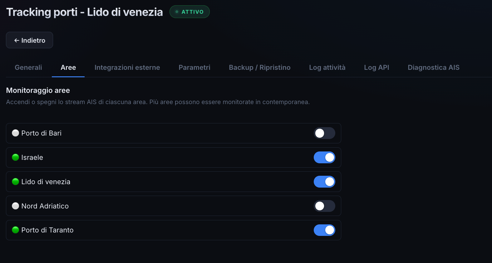

Shows the configured areas with monitoring toggles (equivalent to the panel at the top of General) and links to area management.

### External integrations tab (Telegram + webhooks)

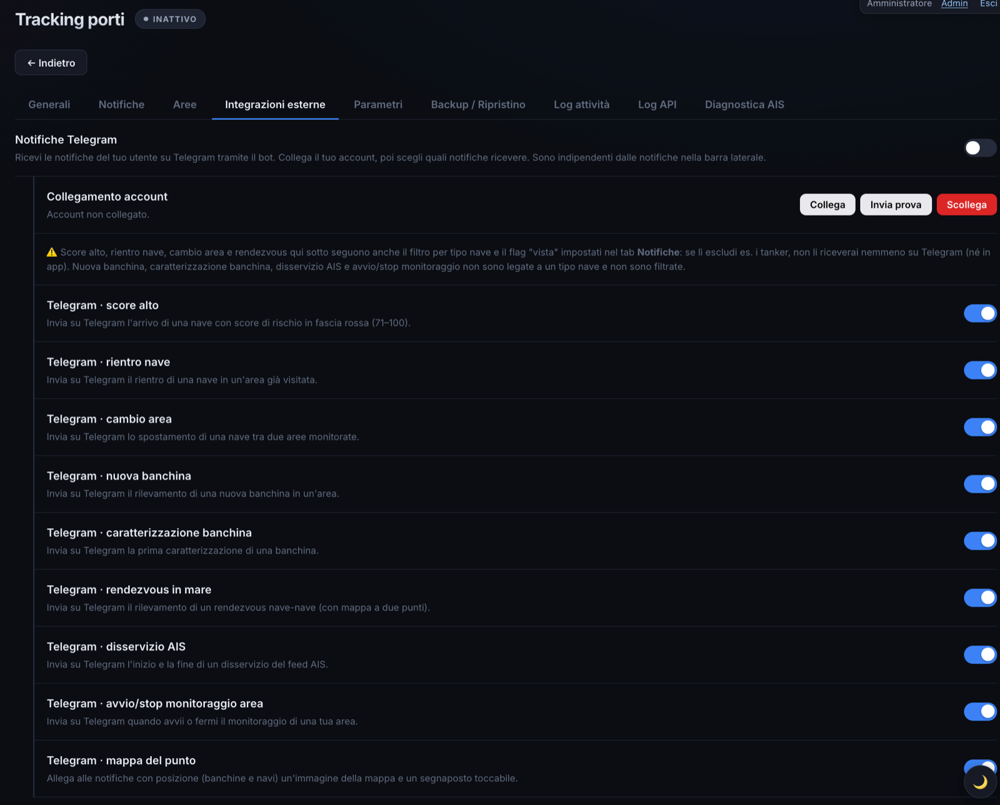

Here you connect the external channels notifications are sent to: **Telegram** (top) and **outgoing webhooks** (bottom).

**Linking Telegram** (works if the administrator has configured the bot):

1. Press **Link**. A link (and a code) appears.
2. Open the link on Telegram (or send the bot `/start <code>`) and start the bot.
3. The bot replies "Account linked" and the tab refreshes: you now receive notifications on Telegram.

To stop, press **Unlink** (or `/stop`). Use **Send test** to check the link.

**Which notifications to receive** — the **Telegram notifications** switch turns everything on/off; below it, a toggle per category: **High score**, **Ship return**, **Area change**, **New berth**, **Berth characterization**, **AIS outage**, **Area monitoring start/stop**. The **Position map** toggle attaches a **map image** plus a tappable pin to notifications that include a position. Telegram toggles are **independent** from the in-app ones.

> Ship notifications (High score, Return, Area change) show **🛰️ Follow** and **⭐ Flag** buttons on Telegram to act directly from the message.

**🔗 Outgoing webhooks** — forwards events from your areas to a web address (Slack, Discord, a SIEM, or your own service):

1. Paste the webhook **URL**.
2. Choose the **format**: *Generic* (raw JSON), *Slack*, or *Discord*.
3. Check **which events** to send (high risk, rendezvous, area change, return, berths, AIS outage).
4. (Optional) set a **secret**: adds an `X-Tracker-Signature` header the recipient can verify.
5. **Add webhook**. **Test** sends a test event; the switch enables/disables it; **Delete** removes it.

> Webhooks are **personal** (only for your areas). Internal/private addresses aren't allowed. Maximum 10 per user.

### Parameters tab

Lets you edit the app's **operating parameters** (ship status thresholds, time windows, retention, berths, score weights…) from the interface. Every field has a description. Edit the values and press **💾 Save parameters**.

> **⚠️ Important:** these parameters are read by the server **only at startup**. After saving, you **must restart the server** for the changes to take effect — reloading the browser is not enough. **Secrets** (API keys, passwords) can't be edited here for security.

### Backup / Restore tab

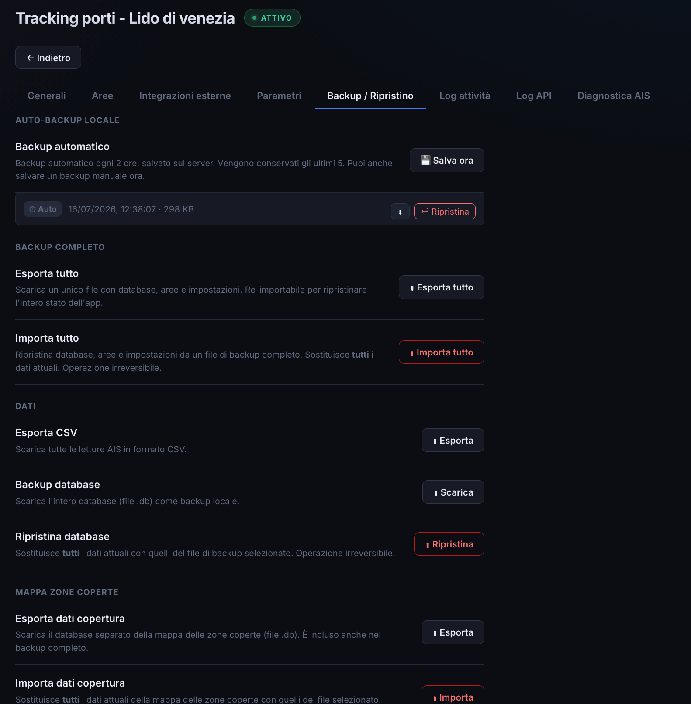

Here you **download a backup** of the database, **restore** a saved backup, and **export** data. The [Coverage map](#coverage-map) data lives in a separate database, exportable/importable on its own and still included in the full backup.

### AIS Diagnostics tab

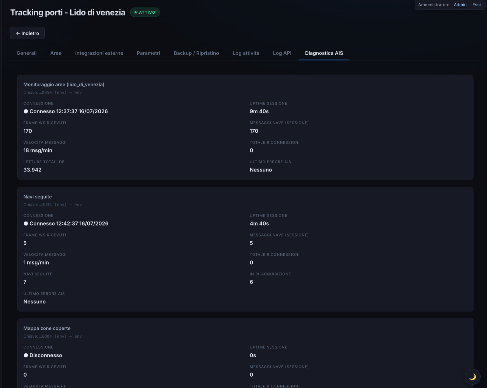

Shows the data stream connection status (refreshes every 5s):

- **Connection** — Connected / Disconnected
- **Session uptime** — how long the stream has been active
- **WS frames received** / **Ship messages** / **Message rate**
- **Reconnections** — how many times the connection was restored
- **Last error** — the most recent error, if any

#### AIS outage banner

If an active monitoring session receives **no AIS signal at all** for a few minutes, the app checks the service status with an independent uptime monitor. Only if that also confirms the outage does a yellow warning appear at the top of monitoring pages. If the area is simply quiet but the service is up, no warning appears.

The same warning also appears if a monitoring session or the **followed ships** stream gets stuck repeatedly reconnecting for a few minutes — never stabilizing, even when each individual attempt only lasts a few seconds (in this case, no external confirmation is needed, since one of our own connections failing to stabilize is an unambiguous signal). In both cases you can dismiss the warning with **✕**; it disappears on its own once the connection stabilizes.

---

## Risk score

Every ship receives a score from 0 to 100, computed automatically. It is indicative and does not replace expert assessment.

| Color | Band | Meaning |
|---|---|---|
| Green | 0–30 | Low risk |
| Yellow | 31–70 | Medium risk — monitor |
| Red | 71–100 | High risk — investigate |

**Source indicators on the badge:**

- **Magenta** dot: computed with VesselFinder data
- **Gold** dot: MarineTraffic data
- **Orange** dot: both sources
- **Red** dot (with halo): ship on a sanctions list (OFAC / EU / UK / UN)
- **Blue** label (Paris/Tokyo MoU ⚓): signal from Port State Control lists
- **Teal** dot: Global Fishing Watch data

Hover over the badge for factor and source details.

**Weight by cargo type:** one factor depends on the ship's cargo class, with configurable weights in **⚙ Settings → "Risk weights by cargo type"** (immediate effect). With **"Exclude tankers"** on, classes on tanker hulls don't assign points.

**Military ships:** automatically at maximum risk (red row).

---

## Notifications

Besides temporary on-screen alerts, the app keeps a **notification history** in the sidebar, opened/closed with **🔔 Notifications** (the state is remembered).

**When a notification is generated** (each category can be enabled separately from [Settings](#settings)):

Ship events:

- **Ship return** — a ship already seen in an area is detected again in the same area.
- **Area change** — a ship seen in one area is detected in a **different** one.
- **High score** — a ship arrives with a score in the red band (71–100).

Berth events:

- **New berth** — a new berth is detected during recomputation.
- **Berth characterization** — a berth is characterized for the first time.

Other events:

- **Rendezvous at sea** — two ships stay close, slow, and offshore long enough (possible transshipment). The notification includes a map with the two points joined by a line.

**Reading a notification:**

| Element | Meaning |
|---|---|
| Dot 🟢 / 🟡 / 🔴 | Color for risk band (ship notifications); berth notifications have a dedicated dot |
| Text | Ship name and area, or origin/destination area (area change), or berth name/category |
| ✓ button | Mark as read |
| 🗑 button | Delete (warning with **↶ Undo** for 5s) |

**Click the notification** (outside the buttons): for a ship, opens its card; for a berth, switches to the area map and centers on the berth.

**Muting a single ship:** in the detail, the **🔔** (active → click to mute) / **🔕** (muted → click to re-enable) button. A muted ship generates no return or area-change notifications.

**Unread** notifications are bold and count toward the red badge. The **last 100** are kept; older ones are deleted. Clearing an area's data also removes its notifications.

---

## Exporting data

All exports are downloaded directly from the browser:

- **CSV** — **⬇ Filtered CSV** in the Current/Past ships toolbar exports the current view (filtered and sorted); **⚙ Settings → Export CSV** instead exports all raw readings.
- **GeoJSON / KML** (for **QGIS** or **Google Earth**) — next to the CSV button you'll find **⬇ GeoJSON** and **⬇ KML**. Four sources: the filtered **ship list** (points), a ship's **track** (from the detail), an area's **replay** (one line per ship), and **berths** (polygons).

---

## Installing the app (PWA)

Tracker Porti is an **installable app** (PWA): you can add it to your phone's home screen or install it on desktop, and it opens full-screen.

- **On phone** — browser → menu → **"Add to Home Screen"** (iPhone/Safari) or **"Install app"** (Android/Chrome).
- **On desktop** — in Chrome/Edge, the install icon in the address bar, or menu → **"Install Tracker Porti"**.

If there's no connection, the app shows an **"You're offline"** screen with a *Retry* button (AIS data is real-time and needs the network). Access stays protected: login is always required.

---

## Frequently asked questions

**The table is empty — what do I do?**
Check that monitoring for the area is started (**● ACTIVE** badge at the top) and that the area has ship traffic. Check the monitored areas from the "Area monitoring" panel in Settings, and the connection from **AIS Diagnostics**.

**How do I avoid losing track of ships I've already checked?**
Use **✓ Seen** on each row: the ship dims, distinguishing it from ones not yet reviewed.

**I changed area and the ships disappeared — is that normal?**
Yes. Each area has independent data and stream. Changing area in the menu is just a view switch: it doesn't start or stop any stream. The previous area's data stays; go back to see it again.

**Can I monitor several areas at once?**
Yes. **⚙ Settings → Area monitoring** and turn on each area's toggle. Then switch between them with the dropdown menu.

**Are military ships always red?**
Yes. They're automatically flagged with maximum score and a red row.

**Can I export the data?**
Yes: CSV, GeoJSON, and KML — see [Exporting data](#exporting-data).
