# User Manual — Tracker Porti

> 🇮🇹 Manuale in italiano: [manuale.md](manuale.md) · [index.html](index.html)

Complete guide to using **Tracker Porti** as an end user. Explains what you can do and how to do it, screen by screen.

> This manual covers day-to-day use of the application. Administration functions (user management, roles, system logs) are not covered here.

---

## What is Tracker Porti

**Tracker Porti** monitors AIS ship traffic in real time over one or more geographic areas of your choice. It collects the data ships broadcast via AIS, analyzes it, computes a **risk score** for every vessel, and presents it all on interactive maps and tables.

You can:

- **monitor several ports/areas** at once, each with its own data stream;
- **see current ships**, **past ships**, and **traffic statistics**;
- **follow individual ships** wherever they go, even outside monitored areas;
- consult the **full detail** of every ship (identity, route, sanctions, suspicious behavior…);
- **receive notifications** in-app and on Telegram for relevant events;
- **export** data (CSV, GeoJSON, KML) and take **backups**.

No technical knowledge is required to use it.

---

## Quick start

1. Open your browser at the server address (e.g. `http://localhost:3000`).
2. **Log in** with your credentials (see [Account and access](#account-and-access)).
3. In the left sidebar, choose the **area** to display from the **Area:** dropdown.
4. Press **▶ Start monitoring** to start receiving data for that area.
5. Ships appear automatically on the map and in the table.

---

## Account and access

The application is protected by **login**: you must authenticate to use it. Each user has their own data (areas, followed ships, notifications, settings), separate from other users'.

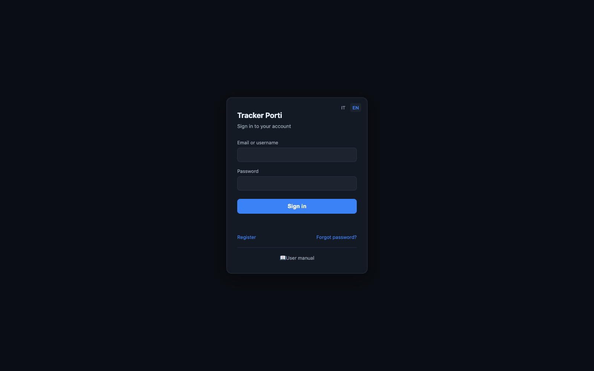

### Registering

From the login page, follow the **Register** link and enter **first name, last name, email, and password**. The new account is created in a *"pending"* state: you'll be able to log in **only after an administrator approves it**. Once approved, log in normally.

### Logging in

On the login page, enter your password and, as identifier, **either your username or your email** (both work). The session stays valid for several days: normally you don't need to re-enter your credentials on every visit.

> After too many failed attempts in a short time (10 in 15 minutes), login is **temporarily blocked** for a few minutes, as anti-bot protection. Wait and try again.

### Logging out

Use the account widget **top right** and choose **Log out**.

### Forgot password

The login page has a **Forgot password?** link. Email delivery is not currently active: to reset your password, **contact an administrator**, who will generate a **one-time link** (valid 24 hours) for you to set a new one.

### Your data

Each user has their **own**:

- monitoring **areas**;
- **settings** (notification preferences, map options, language, default area);
- **flagged ships** ★ and **followed ships**;
- **notifications**.

You see the AIS data of ships located **inside your areas**. Enrichment sources (VesselFinder, MarineTraffic, sanctions, etc.) and the risk-score configuration are instead **shared** and managed by administrators.

> If an administrator puts you in a **user group**, some things (areas, followed/flagged/muted ships, notification and map preferences) are **shared with the other members**: what you add shows up for them and vice versa. Your **Telegram link** and interface **language** stay personal.

---

::: {.tutorial}

## 🚀 First steps (tutorial) {#tutorial}

**Just logged in for the first time? Start here.** This quick guide walks you from the first things to do — defining an area, starting monitoring, searching for and following a ship — to the rest of the app. Every step links to the detailed section further in the manual. Once done, you're operational; the rest of the manual is reference material.

### Step 1 — Define your first area

An **area** is the geographic box you want to watch (a port, a stretch of sea). On first login you may not have one yet.

1. In the sidebar, press **🗺 Areas**.
2. Give the area a **name** (e.g. "Port of Bari").
3. Define the boundaries the easy way: pan and zoom the map until it frames the zone, then press **🎯 Capture current view** (or enter the SW and NE coordinates by hand).
4. Press **＋ Add area**: the area is saved and immediately starts receiving data.

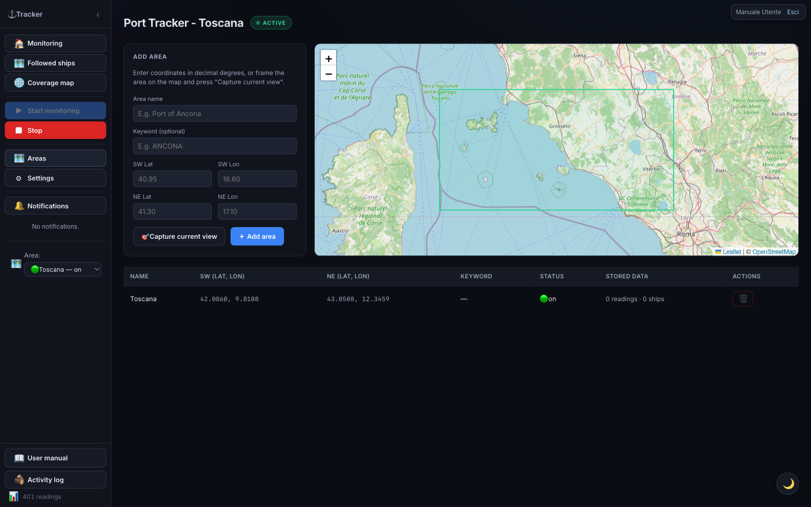

→ Full details in [Managing areas](#managing-areas).

### Step 2 — Start monitoring and watch the ships

1. Go back to monitoring with **🏠 Monitoring**.
2. Select the area in the **Area:** dropdown at the bottom of the sidebar.
3. Press **▶ Start monitoring**: the **● ACTIVE** badge appears at the top.
4. Within a short time, ships appear on the **map** (colored by risk) and in the **table** below. Click a row to open the ship's **detail**.

→ Details in [The three main tabs](#the-three-main-tabs) and [Ship detail](#ship-detail).

### Step 3 — Search for and follow a ship

**Followed ships** are ships you keep an eye on wherever they go, even outside your areas.

1. Sidebar → **🗺 Followed ships**.
2. In the search bar, type the ship's **name** or **MMSI** and press **🔍 Search**.
3. Wait for the results window to fetch identity and **live position** (up to ~90s).
4. When **🗺 Follow ship** becomes enabled, press it: the ship is added to your followed list.

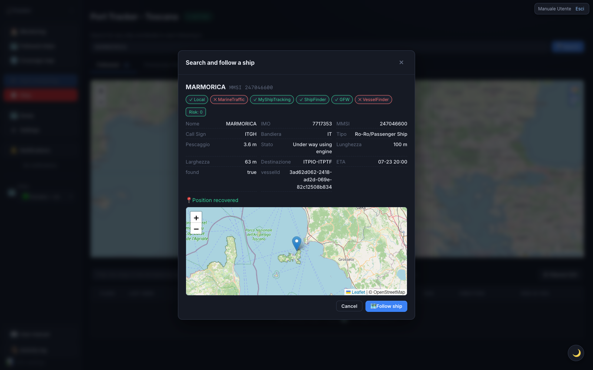

→ Details in [Followed ships](#followed-ships).

### Step 4 — Customize (optional)

- **★ Flag** a ship to highlight it; **✓ Seen** to mark ones you've already checked.
- Turn on **🔔 Notifications** (ship return, high score, etc.) and, if you want, link **Telegram**.
- Switch light/dark **theme** with the 🌙 / ☀️ button, bottom right.

→ See [Notifications](#notifications) and [Settings](#settings).

**That's all it takes to get started.** From here the manual goes into the detail of every feature.

:::

---

::: {.cheatsheet}

## ★ Ship actions: flag, seen, taking charge, following {#ship-actions}

The ship tables show several action icons that look similar but have very different effects on notifications, tables, and the map. This summary helps you pick the right one before diving into the detail of each section later in the manual.

### ★ Flagging a ship

You're saying "this ship matters to me, keep an eye on it" — a manual signal you add yourself, distinct from the automatically calculated risk score.

- **Notifications** — no direct notification to you; if you're in a group, the action shows up in the [Group activity](#group-activity) log and group-mates can get notified if they've turned on the matching option under [Settings → Notifications](#notifications-tab).
- **Tables** — the row stays where it is but gets colored; a "Flagged only" filter lets you see them all together.
- **Map** — purple marker, the style with the highest priority (it beats even the red of a high risk score).
- **Sharing** — personal, but synced across the whole group if you're in one.

### ✓ Marking as seen

You're saying "I already checked this one, no need to look again" — mainly meant for splitting triage work in a group without reviewing the same ships twice.

- **Notifications** — no direct notification; still logged in the group log.
- **Tables** — the effect is stronger here: seen ships **disappear by default** from "Current ships" and "Past ships" (there's a toggle to show them again), while they stay visible under "Followed ships".
- **Map** — no dedicated color; the main effect is simply disappearing from the filtered tables.
- **Sharing** — personal but shared across the group: if a group-mate marks a ship as seen, it disappears for you too.

### 🧑‍✈️ Taking charge of a ship

You're saying "I've got this one" — a way to coordinate in a group over who's handling what. *Visible only if your account is part of a group.*

- **Notifications** — logged in the group log (take/release), with an optional notification to group-mates.
- **Tables** — the row is highlighted in teal, with a dedicated filter (all / taken by me / not taken / a specific member).
- **Map** — no dedicated marker style.
- **Sharing — different from the two above**: it is **not** a single shared label. Several group members can take charge of the same ship together, each with their own independent charge — not one flag that propagates to everyone.

### 👥 Assigning the ship to a group-mate

Same mechanism as taking charge, but assigned to another group member instead of yourself (the **Assign** button in the [ship detail](#ship-detail)). Same effects on tables and map; you can only assign it to an actual co-member of your group — the system checks this.

### 🗺 Following a ship

The most demanding of the five: the ship enters a dedicated, continuous monitoring track, separate from areas — it stays hooked even if it leaves your monitored zones.

- **Notifications** — the richest of the five: besides the group log, it triggers automatic notifications whenever the AIS signal's status changes — the ship goes "searching", is found again, or is lost.
- **Tables** — it lives in a section of its own, [Followed ships](#followed-ships), with dedicated badges like "🔍 searching" or "📍 seen via ShipFinder/MyShipTracking" when AIS goes quiet but a backup source locates it.
- **Map** — has its own dedicated map, just for followed ships.
- **Sharing** — like flag and seen, synced across the whole group.

### In short

- **Flag and seen** are lightweight labels shared across the group: one click, effect on everyone.
- **Taking charge and assigning** are "multi-row" teamwork: each person has their own, nothing gets overwritten.
- **Following** is the most demanding action: it opens a real dedicated monitoring track, with the most automatic notifications.

:::

---

## Main interface

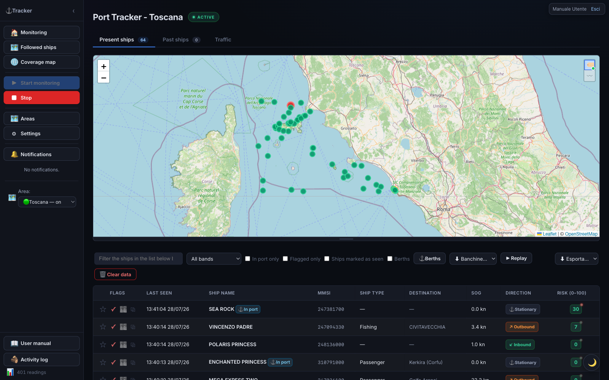

### Sidebar (left)

| Element | Function |
|---|---|
| **🏠 Monitoring** | Return to the home (Current / Past ships / Traffic tabs) |
| **▶ Start monitoring** | Starts real-time AIS data reception for the displayed area |
| **■ Stop** | Stops reception for the current area (already-collected data stays) |
| **🗑 Clear data** | Deletes the readings for the displayed area — **irreversible** |
| **🗺 Areas** | Area management: list, map, add and remove (see [Managing areas](#managing-areas)) |
| **🌐 Coverage map** | World map of AIS coverage (see [Coverage map](#coverage-map)) |
| **⚙ Settings** | App settings, including technical tabs |
| **🔔 Notifications** | Shows/hides the notification list; a red badge counts unread ones |
| **Area:** | Selects the zone to display. Doesn't start or stop the stream — each area has its own. 🟢 = stream active, ⚪ = off |
| **N readings** | Counter at the bottom: positions received during the session |

### Status bar (top)

The **● ACTIVE** badge (pulsing green dot) indicates the displayed area's stream is running. **INACTIVE** means reception for that area is stopped.

### Theme switch

The **🌙 / ☀️** button bottom right toggles dark (default) and light theme.

---

## The three main tabs

The home shows three tabs: **Current ships**, **Past ships**, and **Traffic**.

### 1. Current ships

Ships detected in the area over the last few hours, with a real-time map and table.

**Map:** ships are markers colored by risk band. You can drag the map's bottom edge to resize it. Two buttons in the top-right corner (hover over them to see what they do): **🏷** shows the name next to each ship — with few ships on screen it stays **always visible**, with many it only shows **on hover**; **〰** (off by default) shows each ship's **recent track**, with the same logic: permanent if few ships, on hover over the single ship if many. Your choices are remembered for future visits.

**Table — columns:**

| Column | Meaning |
|---|---|
| Action icons | Flag ★, mark as seen ✓, follow 🗺 |
| Last seen | Date and time of the last position received |
| Ship name | Name of the vessel |
| MMSI | Unique identification code |
| Ship type | Category (cargo, tanker, passenger…) |
| Destination | Declared port. UN/LOCODE codes (e.g. `ITTAR`) are resolved to the port name (e.g. "Taranto") |
| SOG | Speed over ground (knots) |
| Direction | ↙ Inbound / ↗ Outbound / ⚓ Stationary |
| Risk (0–100) | Score (green/yellow/red) |

**Sorting:** click a column header to sort; a second click reverses the order (▲/▼). Sort order persists across automatic refreshes.

**Per-row buttons:**

- **☆ / ★ Flag** — highlights the ship in purple as "to review". Click again to remove.
- **✓ Seen** — marks the ship as already reviewed (the row is dimmed). Useful for not missing new arrivals.
- **🧑‍✈️ Take charge** — *(only if your account is part of a group)* take charge of the ship to split triage work with the other members; more than one person can take charge of the same ship together. If someone already has it, their name tags appear next to it; the ✕ on a tag removes that person from the charge. To assign it to a specific member (instead of yourself), use the menu in the [ship detail](#ship-detail).

**Row colors:**

| Color | Meaning |
|---|---|
| Red 🪖 | Military ship (auto-flagged) |
| Red | High risk score (71–100) |
| Purple | Manually flagged ship |
| Teal | Taken in charge by one or more group members |
| Dimmed | Ship marked as "seen" |
| Badge ⚓ In port | Ship currently moored |

**Click a row** to open the [full detail](#ship-detail).

**Filters (bar above the table):** search by name/MMSI/IMO/destination (and, if you're in a group, also by the name of whoever took charge), filter by risk band, **In port only**, **Flagged only**, **Ships marked as seen**, and the **Berths** checkbox for the mooring overlay. If your account is part of a group, a **taken in charge** dropdown also appears (all / taken by me / not taken / a specific member). On the right: **⚓ Berths**, **⬇ Export…**, and **▶ Replay** buttons.

#### Berths (automatic mooring characterization)

Turning on the **Berths** overlay shows where ships dock and what type they are, learned automatically.

**How it works:**

1. **Mooring detection** — every time a ship stops in port, the system records a mooring point (centroid of the stationary ship's positions in the area).
2. **Grouping** — nearby points are grouped into **berths** (the outline is the envelope of the group's points).
3. **Characterization** — for each berth, ship categories are counted. When one category exceeds **60%** of moorings (out of at least **10** moorings), the berth is **colored** with that category; below the threshold it's **"mixed"** (grey). With fewer than 10 moorings it stays dashed.

**Using the overlay:**

- Check **Berths** in the filter bar to show/hide it (the choice is remembered).
- Every berth has a colored polygon and an always-visible **center dot**.
- **Click a berth** to see its name, characterization, number of moorings, breakdown by category, breakdown by cargo type, and any share of dangerous goods (☢).

**Manual correction** (**⚓ Berths** button): opens the management panel, where you can **rename**, **force the category**, **merge** several berths, **delete** a berth, or **recompute** right away. Clicking a list row centers the map on that berth.

> Berths edited by hand (geometry, name, forced category) **survive automatic recomputation**: manual corrections are never overwritten.

**OpenSeaMap overlay.** In settings (→ General, on by default) there are two independent switches: the **Nautical layer (tile)** draws OpenSeaMap nautical symbols (buoys, lighthouses, lights, signals, anchorages) as a single image; **Markers (selectable)** draws ⚓ markers for moorings/berths/official ports from OpenStreetMap, filterable by category. The data is free (no API key) and coverage in commercial ports may be incomplete.

#### Historical replay (reviewing past traffic)

The **▶ Replay** button replays how traffic in the area moved during a past interval. In replay mode, live markers are hidden and a control bar appears:

- **Area** — which of your areas to replay.
- **Window** — presets **1h / 6h / 24h / all**, or a **custom** interval. It automatically snaps to the most recent available data.
- **▶ / ⏸**, the **scrubber**, and **speeds** (1× / 5× / 20× / 60×).

Each ship moves interpolated between its real positions, leaves a **fading trail**, and is colored by risk; click it for detail. During a **signal gap**, the ship is **hidden** instead of "teleporting". Press **✕ Exit** to return to live.

> If you have the ShipFinder/MyShipTracking integrations enabled, an **Include SF/MST** toggle appears (on by default), which also uses those positions to fill in stretches where AIS is silent.

### 2. Past ships

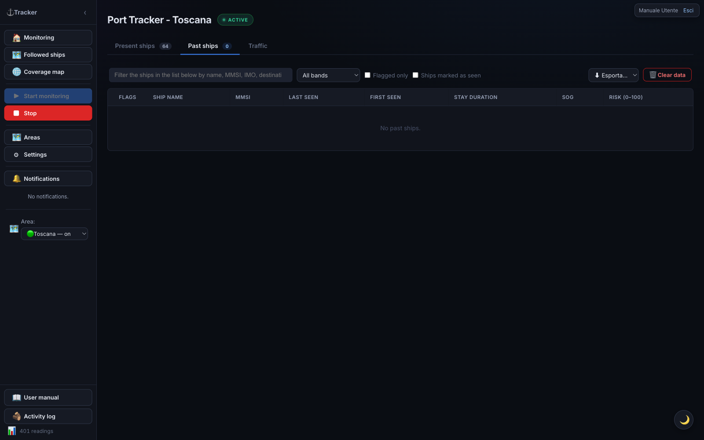

Ships that previously visited the area. Table similar to "Current ships", plus:

- **First contact** — when the ship was first seen;
- **Stay duration** — how long it remained in the area.

Column sorting works as in current ships.

### 3. Traffic

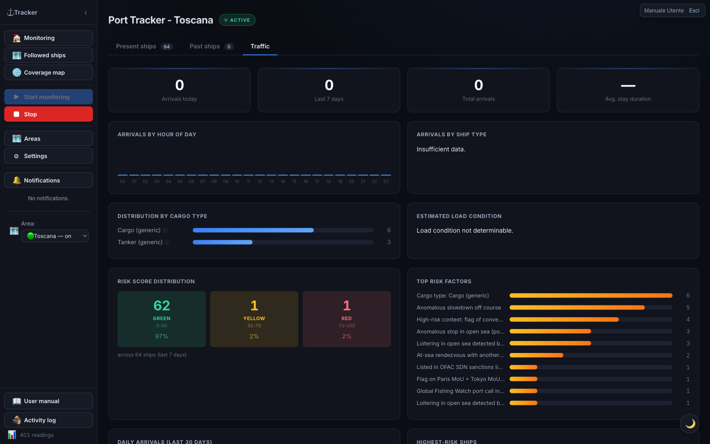

Statistics panel with aggregate indicators and charts.

**Tiles at the top:** Arrivals today · Arrivals last 7 days · Total arrivals · Average stay duration.

**Charts:**

| Chart | What it shows |
|---|---|
| Arrivals by hour of day | Hourly bars (00–23) |
| Arrivals by ship type | Ships per category |
| Risk score distribution | Breakdown low/medium/high |
| Top risk factors | Which factors weigh the most |
| Daily arrivals (last 30 days) | Trend over the month |
| Highest-scoring ships | The riskiest vessels |

**Bottom panels:** **Expected ships** (heading toward the area, matched by keyword in the destination) and **Latest port events** (recent arrivals/departures).

> **How "Expected ships" works.** The table lists ships likely heading toward the area you're currently viewing (not all areas at once, and not just ships you follow). The system keeps one shared database with every ship ever seen in any monitored area; for this table it only picks ships whose **last known position falls inside the current area's geographic boundaries** and whose **AIS-declared destination** contains the keyword configured for this area (e.g. `TARANTO`). Whether you starred or follow the ship doesn't matter — the criterion is purely geographic + declared destination. The ship must have left recently — last seen between 1 and 48 hours ago — if it's still inside the area right now it's already "current" and won't show up here. If the table stays empty, the area probably has no keyword configured (set it in the [Managing areas](#managing-areas) screen): without it, the system doesn't know what to look for.

---

## Followed ships

The **🗺 Followed ships** section collects ships you follow **wherever they go**, even outside monitored areas, via a dedicated AIS stream. A followed ship that drops off AIS coverage **is not lost**: it stays hooked to a worldwide re-acquisition net and is tracked again as soon as it re-transmits.

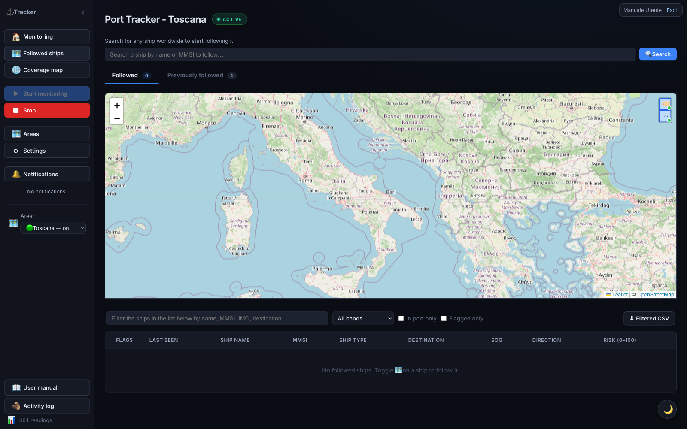

Two sub-tabs: **Followed** (currently tracked) and **Previously followed** (history; a ship ends up here only after a very long silence — default ~6 months — or when you stop following it).

On the **Followed** sub-tab's map, two buttons in the top-right corner (**🏷** and **〰**, hover over them to see what they do) show/hide the **name next to each marker** and a small **recent-track breadcrumb**, useful to see where a ship is coming from. Your choice is remembered for future visits.

Both sub-tabs' tables have the same buttons, row colors and filters as ["Current ships"](#current-ships) — including, if you're in a group, the **🧑‍✈️ Take charge** button and its filter.

### Searching for and following a ship

At the top of the section there's a **search bar**: type **name** or **MMSI** and press **🔍 Search**.

1. A results window opens that stays open while we gather data. If the name matches several ships, pick the right one.
2. The card fills in **progressively**: identity and data from VesselFinder / MarineTraffic / Global Fishing Watch (with an icon showing where it was found), any **sanctions** or **PSC** alerts, and the **live position** on a mini-map.
3. The position is fetched in real time from AISstream: it can take up to ~90s. If the ship isn't transmitting, a warning with **↻ Retry** appears.
4. When the position is available, **🗺 Follow ship** becomes enabled: click it to add it to your followed list.

Closing the window (**Cancel**, **✕**, clicking outside, or **Esc**) stops the search without following anything.

### Re-following a ship from "Previously followed"

When you re-follow a ship that was in **Previously followed** (open its detail and press **🗺 Follow ship**), the app **immediately** puts it back among the followed ones and starts searching for its position in the background:

- if the ship is transmitting, it stays among the followed ones and the position updates;
- if it does **not** transmit within ~90 seconds, it **goes back to "Previously followed"** and you get a **notification** that it wasn't found.

### 🔀 Search ships by transit areas

Below the search bar there is a **🔀 Search ships by transit areas** button. It is there to **discover** the ships sailing between two of your areas, including ones you never followed and may never have noticed.

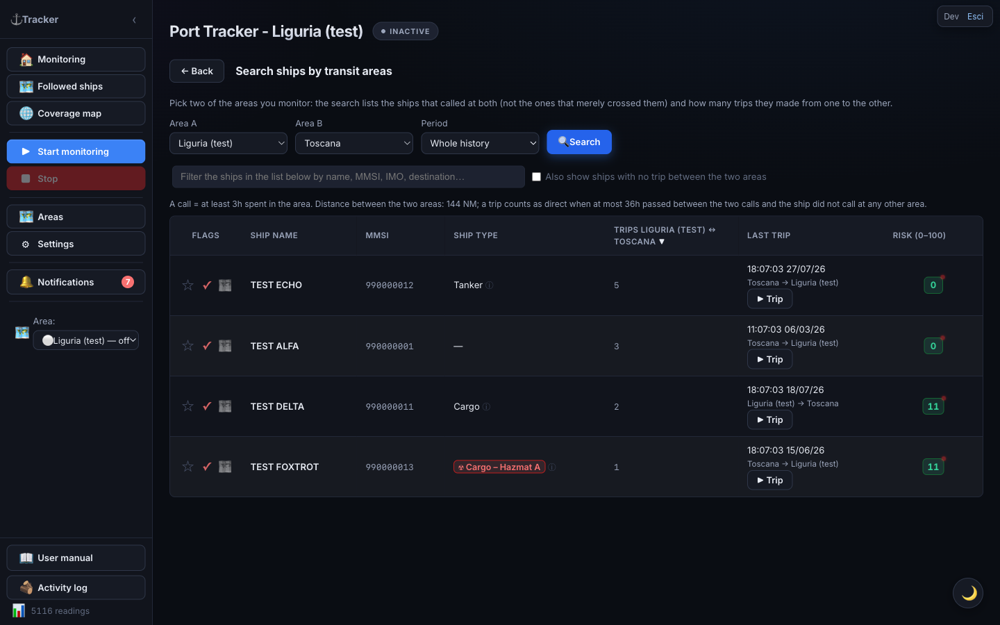

Pick **Area A**, **Area B** and a **Period** (whole history, or last 12 / 6 / 3 months / 30 days), then press **🔍 Search**.

**What it looks for.** Only ships that **called** at both areas and made at least one **trip** from one to the other are listed:

- **Call** = the ship stayed in the area for at least 3 hours (threshold configurable by the administrator). A ship that merely crossed the area's rectangle without stopping does **not** count: areas are rectangles that can cover a lot of open sea, and passing through does not mean the ship was headed there.
- **Trip** = two consecutive calls, one in each of the two areas, with no call at **any other** monitored area (anyone's) in between, and an elapsed time compatible with the passage. The line under the filters recalls the values used: distance between the two areas and maximum time allowed.

A ship that called at both areas but never made the direct leg (it went elsewhere in between, or too much time passed) can still be listed with the **Also show ships with no trip between the two areas** checkbox.

**The table** uses the same buttons, row colors, sorting and search filter as the other lists — so you can **flag**, **mark as seen**, **follow** or **take charge of** a ship straight from here, without opening it. The specific columns are:

| Column | Meaning |
|---|---|
| Trips A ↔ B | How many times the ship sailed between the two areas, in either direction. Hover over it to also see how many calls it made in each area |
| Last trip | Arrival date of the last trip and its direction (e.g. "Toscana → Ravenna"), plus the **▶ Trip** button |

Clicking a row opens the **[ship detail](#ship-detail)** as in the other tables.

**▶ Trip** opens a window with the **map of the last trip** and a playback control: **▶** starts the animation, the slider moves through time, and the date of the moment being played is shown next to it.

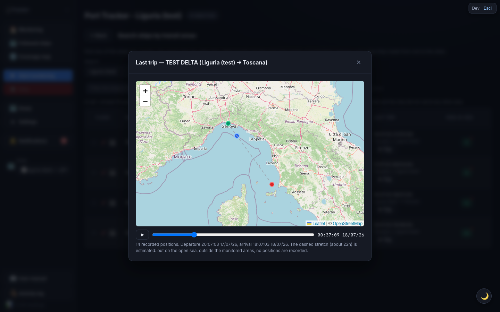

> ⚠️ **The dashed grey stretch is an estimate.** Positions are only recorded inside the monitored areas: out on the open sea there is no data at all, so the link between leaving one area and arriving in the other is a hypothetical straight line, not the real route. The note under the map states how many real positions exist and how many hours of the trip are estimated. The departure and arrival dates, on the other hand, are real.

> 💡 The counts in this search are based on **port events** (arrivals and departures), which are kept for a long time; **positions** are kept for a much shorter period. That is why a trip can be listed while its map holds few positions or none: the window tells you so explicitly.

---

## Group activity

If your account is part of a **group** (created by an administrator), the sidebar shows a **👥 Group activity** entry right below "Followed ships". Group members share areas, followed/flagged/muted/seen ships and some settings: this section helps you see **who did what** instead of just trusting the shared state blindly. **Taken in charge** (see [Current ships](#current-ships) and [Ship detail](#ship-detail)) is an exception: it isn't shared the same way — several members can take the same ship together — but every take/release/assignment still shows up here.

The section has two tabs:

### Group info

Shows the **group name** and the list of **members** (your own name is marked "(you)").

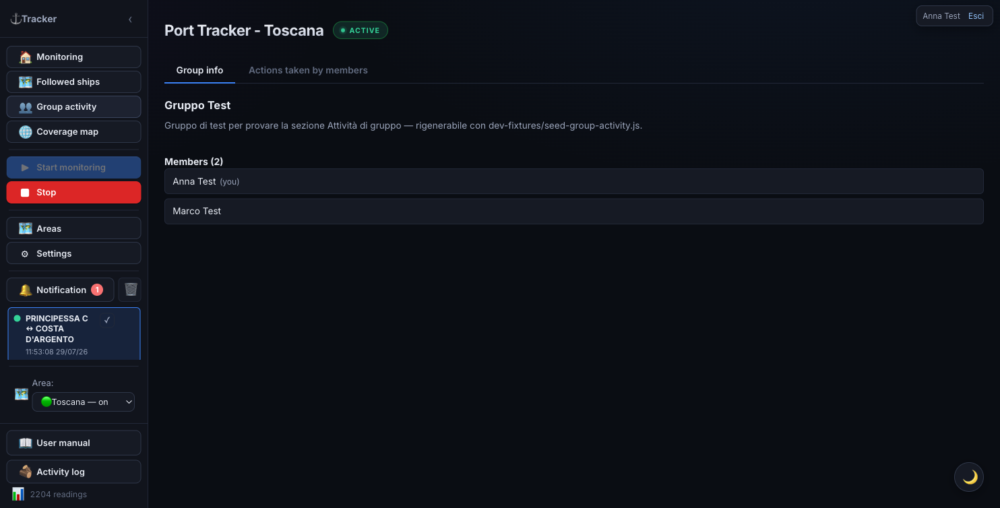

### Actions taken by members

A table, newest-first, of every group action a member has taken — columns **Date and time**, **User**, **Action**: adding/removing a shared area, starting/stopping following a ship, flagging, muting notifications, marking as seen, taking/releasing/assigning charge of a ship, changing a shared setting. The Action column is a readable sentence — e.g. *"Started following ship BODAN: the group will get notified of its movements."* The search box above the table filters rows by ship, area, user or action type. The **Load more** button at the bottom fetches older actions.

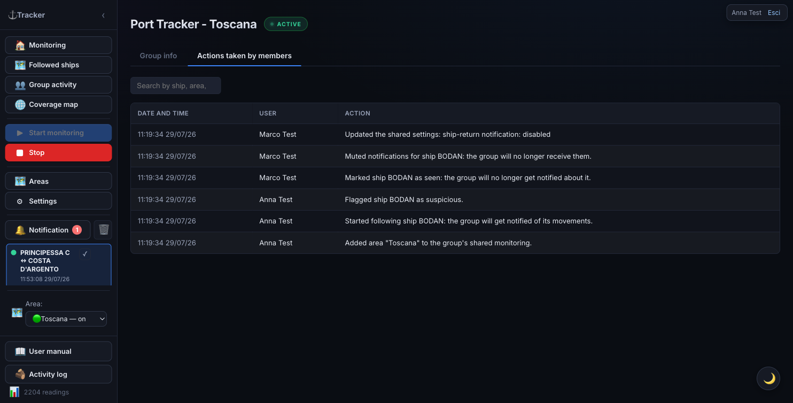

> Want to be notified in real time instead of checking this table? See [Group activity notifications](#group-activity-notifications).

---

## Ship detail

Clicking any table row (or a ship's notification) opens the full detail card, organized into **tabs**: **General**, **Readings**, plus one tab per enabled external source (VesselFinder, MarineTraffic, ShipFinder, MyShipTracking, Equasis, Global Fishing Watch). A source disabled in Settings has no tab.

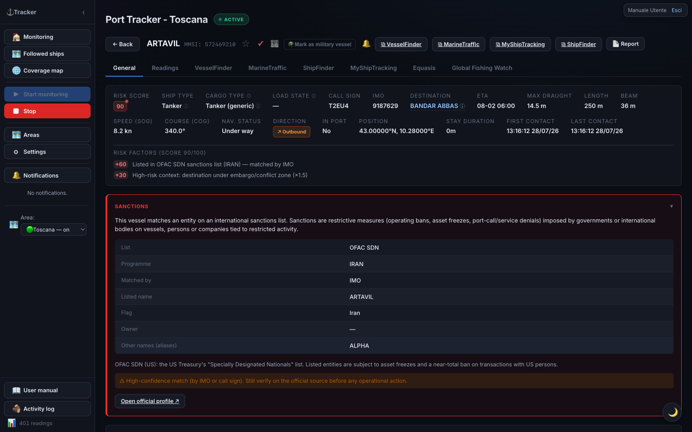

### Header and actions

- **← Back** — return to the list
- **★ Flag** / **✓ Seen** — flag / mark as reviewed
- **🪖 Mark as military ship** — classifies the ship as military (red row, maximum risk)
- **🔔 / 🔕** — mute or re-enable automatic notifications for this ship
- **🧑‍✈️ Take charge / Assign** — *(only if your account is part of a group)* next to the tags of whoever already took charge of the ship, you'll find a button to take charge yourself and an **Assign** button that opens a menu with the group's other members: click a name to assign it to them (or to remove it, if already checked ✓). Any group member can remove anyone else's charge by clicking the ✕ on their tag.
- **⧉ VesselFinder / MarineTraffic / ShipFinder / MyShipTracking** — open the external page
- **Report** — generates a report for the ship

### General tab

The first tab, open by default, gathers everything that **isn't specific to a single external source**: information grid, risk factors, aggregated ship data table (below), operational notes, visit history in monitored areas, and — when present — sanctions and rendezvous at sea. The map with track/replay and the raw AIS readings live in the **Readings** tab instead (see below). Each enabled external source has its own dedicated tab (see below).

### Information grid

All available data for the ship:

| Field | Meaning |
|---|---|
| Risk score | Colored badge 0–100 |
| Ship type | Category; "☢ Hazmat" if carrying dangerous goods |
| Cargo type | Cargo class (container ship, tanker, chemical tanker, gas carrier, bulk carrier…) with source in parentheses |
| Load status | Estimated laden / partial / ballast from declared draught |
| Call sign | Radio call sign |
| IMO | IMO registration number |
| Destination | Declared port |
| ETA | Estimated time of arrival |
| Max draught | Hull depth in water (m) |
| Length / Beam | Physical dimensions |
| SOG / Course | Current speed and heading |
| Nav status | Moored, underway, etc. |
| Direction | Inbound / outbound / stationary |
| Position | Last latitude and longitude |
| Stay duration | Time elapsed since arrival |
| First / Last contact | Timestamp of the first and last data received |

### Risk factors

List of the factors that contributed to the score, with each one's points. If there are no anomalies, "No anomalies detected" is shown.

### Aggregated ship data (all providers)

Below the map, the General tab shows a table gathering the **main ship data as reported by each enabled external source** — name, IMO, MMSI, call sign, flag, type, year built, length, beam, draught, gross tonnage, deadweight, home port — without having to open every provider's tab to compare them.

- When several sources report **the same value** — even spelled differently (e.g. flag "PAN" and "Panama", length "202.80" and "203") — it appears **once**, with a **colored dot per confirming source** next to the value.
- When sources **disagree**, **every distinct value** reported appears instead, each with its own colored dot, and the row is highlighted with a light tint so it stands out at a glance: it's a sign one of the sources likely has a wrong or stale value, worth checking.
- **Hover over a dot** to see which source it is — the same color used to tell apart the respective tabs (VesselFinder, MarineTraffic, ShipFinder, MyShipTracking, Equasis, Global Fishing Watch).
- Fields that change often (destination, ETA, live draught, nav status) **don't** appear in this table: they stay in the information grid and in each provider's own tab, where the time of the reading matters.

The table only appears once **at least one source** has data for the ship; it stays empty (hidden) until a source has responded.

### VesselFinder / MarineTraffic tab

If enabled in settings, the respective tab shows additional information fetched from these services (flag, gross tonnage, year built…), noting whether it's cached. Fetching happens automatically in the background for recently seen ships.

### ShipFinder and MyShipTracking tabs (re-locating followed ships)

If you enable **Import ShipFinder** and/or **Import MyShipTracking**, the corresponding tabs appear. Besides static data, these sources provide the **last-sighting position**, used to **re-locate followed ships AIS can no longer see**:

- **Automatic** — for every followed ship that hasn't transmitted in a while, the app periodically queries these sources in the background. If it finds a position, it appears on the mini-map (General tab) as a distinct marker (**orange** = ShipFinder, **teal/cyan** = MyShipTracking), without altering the AIS track, score, or replay.
- **Dedicated badge** — when a position exists, a **📍 seen on ShipFinder/MyShipTracking · <date>** badge appears next to the name, distinct from the yellow **🔍 searching** badge (which reflects AIS status). The "searching" badge only turns off with a real AIS signal.
- **Manual** — the **📍 Locate via ShipFinder / MyShipTracking** button fetches the current position **right away**.

> The tabs appear **only if the integration is enabled** (Settings → Import…). Off by default. On the Followed ships map, a ship AIS can no longer see is shown at its most recent SF/MST position (grey marker) and returns to live AIS as soon as it re-transmits.

### Equasis tab (ownership / management)

If the Equasis lookup is enabled, the **Equasis** tab appears with a **Fetch Equasis information** button. **Never runs automatically**: the lookup only happens on click and queries Equasis by **IMO number**. It returns ship data, **ownership and management** (owner, ISM manager, operator), classification, P&I coverage, performance/risk indicators, and recent positions. The result is stored once and shown with no expiry.

### Global Fishing Watch tab

If GFW enrichment is enabled (on by default), the **Global Fishing Watch** tab appears with the ship's **identity** and tables of **behavioral events** derived from the global AIS feed:

- **Encounters** — two ships meeting in open water (a transshipment signature).
- **Loitering** — prolonged stop in open water.
- **Port visit** — reconstructed port calls.
- **AIS off (gap)** — transponder off while underway ("dark activity").

Every event table is **sortable**: click a column header to sort, click again to reverse (default sort is by date, most recent first). Tables with more than 10 rows are **paginated**, with **‹ Prev** and **Next ›** buttons at the bottom.

Enrichment is **proactive** (no button). GFW mainly tracks fishing, support, and reefer/carrier vessels: many merchant ships aren't present (a "not found in GFW" note). These events **feed the risk score**.

### Sanctions

When a ship matches a sanctions list, the **Sanctions** panel appears at the top of the detail — with a red border:

- **List** — the matching regime: OFAC SDN (USA), EU consolidated list, UK OFSI, or UN.
- **Programme** — the specific sanctions programme, if available.
- **Matched by** — the field the match was made on: **IMO** or **call sign** (high confidence) or **name** (weaker, possible homonym).
- **Listed name**, **flag**, **owner**, and **aliases** of the entity, when available.

A notice reminds you to always verify against the official source (a **name-only** match can be a false positive). When an identifier is available, **Open official profile** opens the public page. The panel appears **only** for listed ships.

### Rendezvous at sea

If the ship has had a confirmed **rendezvous** with another one (stayed close, slow, and offshore long enough — a ship-to-ship transshipment signature), the **Rendezvous at sea** section appears with the list of encounters (other ship, date/time, minimum distance, area). Every row is clickable and opens the ship involved. A confirmed rendezvous triggers a **notification** and **adds risk points to both** ships.

### Readings tab

The **Readings** tab gathers everything about the ship's raw position: the track/replay map at the top, and below it, the table of every reading received in chronological order.

**Map and replay** — stays **pinned at the top** while you scroll the table below, so you can always see where you are along the route.

- **Time window** — presets **6h / 24h / 7d / all**, or a **custom** interval (From → To, then **Apply**).
- **▶ / ⏸** — plays/pauses the track animation.
- **Scrubber** — jumps to any point on the track.
- **Speed** — **1× / 5× / 20× / 60×** (default 20×), changeable during playback.
- **Include SF/MST** — if the integrations are active and the ship has scraped positions, includes them in the track (amber nodes = ShipFinder, teal = MyShipTracking).

> The **last known position** markers for ShipFinder/MyShipTracking shown on the map follow the **same time window** selected for the track (preset, custom interval, or replay segment): narrowing the window only shows sightings that fall within it, exactly as with AIS positions. The **📍 Locate via …** button always shows the just-fetched position regardless.

**Readings table** — every position received, in chronological order, with a **Source** column (colored dot + label: green = AISStream, orange = ShipFinder, teal = MyShipTracking) so you can immediately tell real AIS data apart from a backup fix. Navigate with **← Prev** and **Next →**.

- **Click a row** (with a known position) → the ship in the replay above jumps exactly to that point. Handy to see at a glance where the ship was at a precise moment, without manually dragging the slider.
- **📄 icon** on the row → opens the raw data received (full JSON). For simple position messages, the useful fields are already in the grid; the raw data mainly matters for static messages (name, dimensions, destination…).

### Operational notes

Free-text area: write any notes about the ship and press **Save notes**. Notes are persisted in the database.

### Visit history in monitored areas

Log of all arrivals (↙) and departures (↗) detected for the ship, with the **monitored area** they occurred in, destination, draught, and stay duration. UN/LOCODE codes in the destination are resolved to the port name (e.g. `ITNAP` → "Napoli").

The ⓘ icon next to the title explains the concept: a "monitored area" is the geographic box you configured (see [Managing areas](#managing-areas)), not necessarily a single real port — it can cover an entire gulf with several harbours, or just one berth. An "arrival" is logged when the ship reappears in the area after being absent more than 60 minutes (or is seen there for the first time); a "departure" when it stops being seen while still logged in the area.

---

## Managing areas

Open with **🗺 Areas**. Here you add and remove monitored areas **without restarting the app**.

The screen contains:

- an **"Add area" panel** (top left), which doubles as the **editor** for the selected area;
- a **map** with all areas as rectangles (green = stream active, purple = area in view, blue = others);
- a **table** with name, SW and NE coordinates, keyword, stream status, saved data, and delete button. **Rows are clickable**: one click loads the area into the panel above (see [Editing an area](#editing-an-area)).

### Adding an area

1. Write a **name** (required) and, if you want, a **keyword** (for the "Expected ships" filter).
2. Specify the boundaries in **one** of two ways:
   - **GPS coordinates** — enter by hand the latitude and longitude in **decimal degrees** of the two SW (South-West) and NE (North-East) corners. E.g.: SW `40.95, 16.60` — NE `41.30, 17.10`. A preview rectangle appears as you type.
   - **From map** — frame the area by panning/zooming the map, then press **🎯 Capture current view**: the coordinates fill in on their own.
3. Press **＋ Add area**. The area is saved and its stream starts immediately.

> Latitude ranges from -90 to 90 (positive to the North), longitude from -180 to 180 (positive to the East). Corners can be entered in any order: they are automatically reordered.

### Editing an area

**Click (or tap) a row in the table**: the area is loaded into the panel above — which turns into **"Edit area: <name>"** — and the map moves onto its boundaries, showing them as a dashed rectangle.

From there you can change the **name**, the **keyword** and the **coordinates** (by hand or with **🎯 Capture current view**, after framing the new boundaries). Press **💾 Save changes** to apply, or **Cancel edit** (or click the same row again) to leave without saving.

> **The history is not lost.** The area stays the same one: readings, ships and events collected so far remain attached to it even if you move its boundaries. If the area's stream is running, it restarts immediately on the new boundaries. Readings collected while the area was wider stay in the history, even if they fall outside the new boundaries.

> **Shared areas.** If other users monitor the same area, the change applies to them too. Before saving you are asked to **confirm twice**, and once saved every other user monitoring that area gets a notification in **👥 Group activity notifications**.

### Removing an area

Press 🗑 on the area's row. **Removing the area also deletes all related history** (readings, ships, and port events). For safety, deletion **is not immediate**: a warning appears with a countdown and an **↶ Undo** button for **10 seconds**. It becomes final when the time expires or when you leave the Areas page.

> **At least one area** must remain: the delete button is disabled when only one is left.

---

## Coverage map

Opens from **🌐 Coverage map**. Shows a **world map** where each cell is colored according to **how many AIS messages are received** in that zone: from **blue** (few) to **red** (many). Useful for seeing at a glance where AIS coverage is good and where there are "holes".

As a user, you can **open the map and see the current data** (read-only for you). The map is also available **without login** at `/heatmap`. Starting and stopping data collection is reserved to administrators.

A **🧹** button in the top-right corner (hover over it to see what it does) hides — **on by default** — cells with a **single message**: almost always isolated noise (e.g. satellite positioning artifacts far from any real route) rather than real coverage. Your choice is remembered for future visits.

---

## Settings

Open with **⚙ Settings**. Settings are organized into **tabs**: **General**, **Notifications**, **Areas**, **External integrations**, **Parameters**, **Backup / Restore**, and the technical **📡 AIS Diagnostics** tab.

### General tab

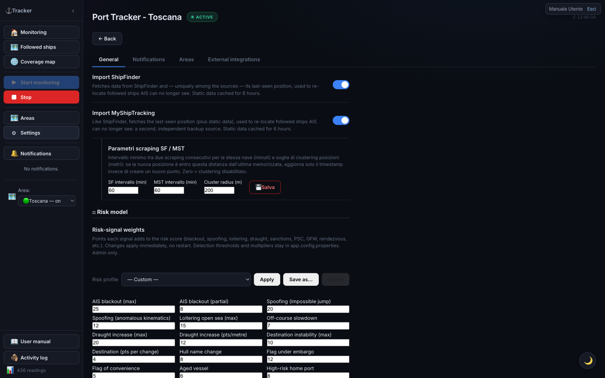

At the top, the **Area monitoring** panel shows all areas with a toggle to start/stop each one's stream (🟢 active / ⚪ off): this way you monitor several areas together.

Below, the toggles for **data sources and features**:

| Option | Function |
|---|---|
| **VesselFinder** / **MarineTraffic** | Fetches additional data in the ship detail. Cache 6 hours. |
| **Import ShipFinder** | Data + **last position** to re-locate lost followed ships (orange markers). Off by default. |
| **Import MyShipTracking** | Second, independent position source (teal markers). Off by default. |
| **Sanctions screening** | Matches every ship against the OFAC SDN list (by IMO/name/call sign). Refreshed every 24h; **Refresh list** forces a download. |
| **Additional sanctions lists (EU / UK / UN)** | Adds the EU, UK OFSI, and UN lists (via OpenSanctions). Only active with sanctions screening on. Default on. |
| **Port State Control screening (Paris/Tokyo MoU)** | White/grey/black flag performance + Paris MoU banned ships. |
| **Equasis lookup (ownership)** | Enables the on-demand button in the detail. Never automatic. |
| **Global Fishing Watch** | Identity + behavioral events (proactive). On by default. |
| **Check position jump** / **Check AIS blackout** | Includes these signals in the risk score. Disable them in areas with poor AIS coverage (false positives). Default on. |
| **OpenSeaMap nautical layer (tile)** | Nautical symbols as a single image (all or nothing). Default on. |
| **OpenSeaMap markers (selectable)** + **Items to show** | ⚓ markers filterable by category (ports, moorings, anchorages, marinas, lighthouses, buoys, hazards…). Default on. |
| **Risk weights by cargo type** | Points assigned to each cargo class. Edit and **💾 Save weights** (immediate effect). |
| **⬇ Export CSV** | Downloads all readings as CSV. |
| **⬇ Download backup** / **⬆ Restore** | Downloads/reloads the database file. |
| **Language** | Italiano / English. |

> **Warning:** **restoring** the database replaces **all** current data and is irreversible. Download a backup before proceeding. After restoring, data is reassigned to the correct area based on coordinates.

### Notifications tab

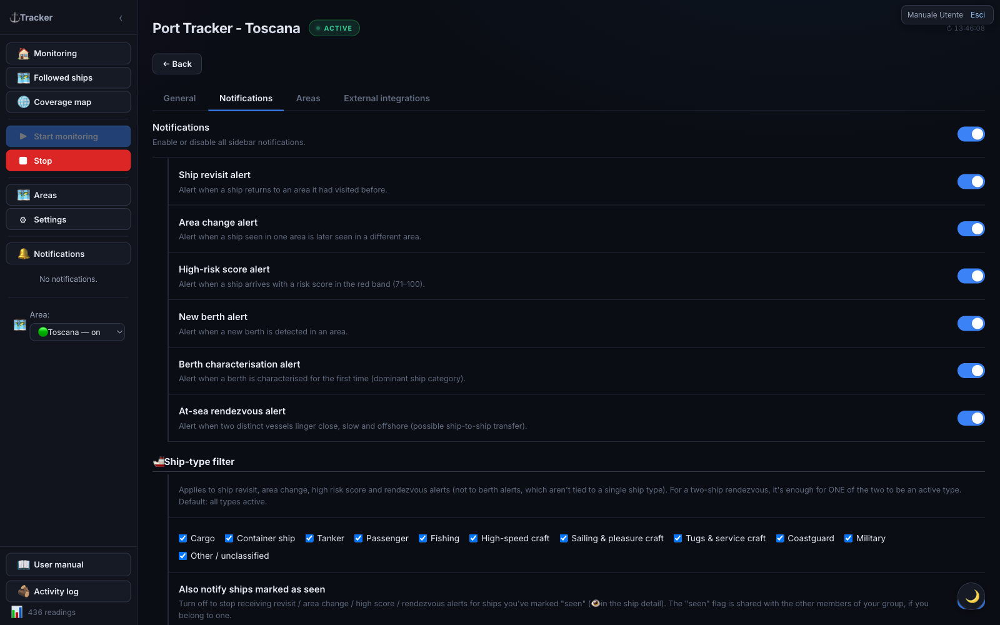

Here you decide **which events** raise a notification in the sidebar (and, if linked, on Telegram — see the External integrations tab).

| Option | Function |
|---|---|
| **Notifications** | Master switch: off, no in-app notification arrives at all (regardless of the toggles below). |
| **Ship revisit notification** | Alerts when a ship **already seen before** in the same area returns to it after a period of absence. |
| **Area change notification** | Alerts when a ship that **called** at one of your areas is detected in **another** of your areas. It does not fire for ships that merely crossed the origin area without stopping, nor when the origin call is too old to explain the current arrival, nor between two overlapping areas (see [When an area change fires](#when-an-area-change-fires)). |
| **High score notification** | Alerts when a ship **arrives** with a risk score in the red band (71–100). The most useful one for quick triage: no need to watch the table to notice it. |
| **New berth notification** | Alerts when the app automatically detects a **new berth** in an area (a mooring cluster not seen before). |
| **Berth characterization notification** | Alerts when a berth (automatic or manually corrected) is **classified for the first time** by its dominant ship category (e.g. "Cargo", "Passenger"). |
| **At-sea rendezvous notification** | Alerts when two distinct ships linger close together, slow and offshore for a while — a possible ship-to-ship transfer. |

**🚢 Ship-type filter** — a list of categories, each with its own checkbox (Cargo, Container ship, Tanker, Passenger, Fishing, High-speed craft, Sailing & pleasure craft, Tugs & service craft, Coastguard, Military, Other/unclassified): **all active by default**. Uncheck a category to **stop being notified** for that ship type. Applies only to ship revisit, area change, high score, and rendezvous (not to new berth/berth characterization, which aren't about a specific ship type); for a two-ship rendezvous, it's enough for **one of the two** to be a checked type to get notified. Example: to follow only merchant traffic, uncheck Passenger, Fishing, Sailing & pleasure craft, Tugs & service craft, Coastguard — you'll stay notified for Cargo, Container ship, Tanker (and optionally Military, High-speed craft, Other, if you leave them checked).

> Note: "Container ship" is distinguished from "Cargo" only once the app already has VesselFinder/MarineTraffic enrichment data for that ship (obtained by opening its detail, or via automatic backfill if enabled). A cargo ship just spotted and not yet enriched shows up temporarily as "Cargo" even if it's actually a container ship.

| Option | Function |
|---|---|
| **Also notify ships marked as seen** | On by default. Turn it off to **stop** receiving revisit / area change / high score / rendezvous alerts for ships you've marked "seen" 👁 (from the ship detail) — handy so you're not re-alerted about ships you've already checked. If you belong to a **user group**, the "seen" flag is shared: a ship marked seen by a group-mate shows as seen for everyone, so you can split up the checking work. |

**👥 Group activity** *(visible only if you're in a group)* — one row per shared action (see [Group activity](#group-activity)): decide whether you get the [matching notification](#group-activity-notifications) when a group-mate performs it. All on by default.

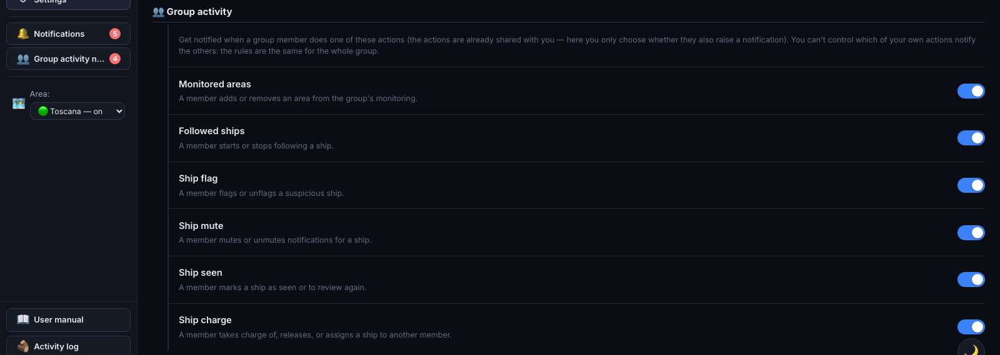

| Option | Function |
|---|---|
| **Monitored areas** | A member adds or removes an area from the group's monitoring. |
| **Followed ships** | A member starts or stops following a ship. |
| **Ship flag** | A member flags or unflags a ship. |
| **Ship mute** | A member mutes or unmutes a ship's notifications. |
| **Ship seen** | A member marks a ship as seen or to review again. |
| **Ship charge** | A member takes charge of, releases, or assigns a ship. |

Next to each row are two smaller switches — **✈️** (also send on Telegram, if you've linked your account) and **🔗** (include in any webhooks you've configured) — shown only when applicable, enabled only while the row's main switch is on.

### Areas tab

Shows the configured areas with monitoring toggles (equivalent to the panel at the top of General) and links to area management.

### External integrations tab (Telegram + webhooks)

Here you connect the external channels notifications are sent to: **Telegram** (top) and **outgoing webhooks** (bottom).

**Linking Telegram** (works if the administrator has configured the bot):

1. Press **Link**. A link (and a code) appears.
2. Open the link on Telegram (or send the bot `/start <code>`) and start the bot.
3. The bot replies "Account linked" and the tab refreshes: you now receive notifications on Telegram.

To stop, press **Unlink** (or `/stop`). Use **Send test** to check the link.

**Which notifications to receive** — the **Telegram notifications** switch turns everything on/off; below it, a toggle per category: **High score**, **Ship return**, **Area change**, **New berth**, **Berth characterization**, **AIS outage**, **Area monitoring start/stop**. The **Position map** toggle attaches a **map image** plus a tappable pin to notifications that include a position. Telegram toggles are **independent** from the in-app ones (you can receive a category on Telegram only, or in-app only).

> ⚠️ The **High score**, **Ship return**, **Area change**, and **At-sea rendezvous** categories still follow the **ship-type filter** and the **"seen"** flag set in the **Notifications** tab: if you exclude e.g. tankers there, those alerts won't arrive either in-app or on Telegram. New berth, characterization, AIS outage, and area monitoring start/stop aren't tied to a ship type and are never filtered.

> Ship notifications (High score, Return, Area change) show **🛰️ Follow** and **⭐ Flag** buttons on Telegram to act directly from the message.

**🔗 Outgoing webhooks** — forwards events from your areas to a web address (Slack, Discord, a SIEM, or your own service):

1. Paste the webhook **URL**.
2. Choose the **format**: *Generic* (raw JSON), *Slack*, or *Discord*.
3. Check **which events** to send (high risk, rendezvous, area change, return, berths, AIS outage).
4. (Optional) set a **secret**: adds an `X-Tracker-Signature` header the recipient can verify.
5. **Add webhook**. **Test** sends a test event; the switch enables/disables it; **Delete** removes it.

> Webhooks are **personal** (only for your areas). Internal/private addresses aren't allowed. Maximum 10 per user.

### AIS outage banner

If an active monitoring session receives **no AIS signal at all** for a few minutes, the app checks the service status with an independent uptime monitor. Only if that also confirms the outage does a yellow warning appear at the top of monitoring pages. If the area is simply quiet but the service is up, no warning appears.

The same warning also appears if a monitoring session or the **followed ships** stream gets stuck repeatedly reconnecting for a few minutes — never stabilizing, even when each individual attempt only lasts a few seconds (in this case, no external confirmation is needed, since one of our own connections failing to stabilize is an unambiguous signal). In both cases you can dismiss the warning with **✕**; it disappears on its own once the connection stabilizes.

If the outage lasts several hours, the app automatically switches to recovering ship positions from other sources (ShipFinder/MyShipTracking) instead of the AIS feed alone, to keep a minimum level of monitoring going: the banner says so explicitly ("Fallback mode active"), and returns to normal on its own once AIS stabilizes again.

---

## Risk score

Every ship receives a score from 0 to 100, computed automatically. It is indicative and does not replace expert assessment.

| Color | Band | Meaning |
|---|---|---|
| Green | 0–30 | Low risk |
| Yellow | 31–70 | Medium risk — monitor |
| Red | 71–100 | High risk — investigate |

**Source indicators on the badge:**

- **Magenta** dot: computed with VesselFinder data
- **Gold** dot: MarineTraffic data
- **Orange** dot: both sources
- **Red** dot (with halo): ship on a sanctions list (OFAC / EU / UK / UN)
- **Blue** label (Paris/Tokyo MoU ⚓): signal from Port State Control lists
- **Teal** dot: Global Fishing Watch data

Hover over the badge for factor and source details.

**Weight by cargo type:** one factor depends on the ship's cargo class, with configurable weights in **⚙ Settings → "Risk weights by cargo type"** (immediate effect). With **"Exclude tankers"** on, classes on tanker hulls don't assign points.

**Military ships:** automatically at maximum risk (red row).

---

## Notifications

Besides temporary on-screen alerts, the app keeps a **notification history**: the **🔔 Notifications** sidebar button shows an unread-count badge and, when clicked, opens an **overlay window** with the list (close it with **✕**, **Esc**, or by clicking outside).

**When a notification is generated** (each category can be enabled separately from [Settings](#settings)):

Ship events:

- **Ship return** — a ship already seen in an area is detected again in the same area.
- **Area change** — a ship that **called** at one of your areas is detected in a **different** one (see [When an area change fires](#when-an-area-change-fires)).
- **High score** — a ship arrives with a score in the red band (71–100).

#### When an area change fires

The **area change** notification is meant to say something precise: *this ship had called at one of your areas, and has now arrived in another one*. To keep that claim reliable, the app discards three situations in which it would be misleading:

| Situation | Why no notification arrives |
|---|---|
| The ship only **crossed** the origin area | An area is a rectangle of interest, not a port: it may cover hundreds of km of open sea. A ship passing through it on its way elsewhere does not "come" from there. A call of at least 3 hours is required |
| The origin call is **too old** | If far more time has passed since the last call than the passage requires (the limit depends on the distance between the two areas), the ship has been elsewhere in the meantime — and we cannot say where, because outside the monitored areas we receive no positions |
| The two areas **overlap** | If one area contains the other (or the two intersect), the same position belongs to both: the ship has not moved at all, only the label changes. Without this filter a moored ship would generate a stream of fake movements |

The thresholds are adjustable by the administrator, who can also check in the activity log which notifications were discarded and why — useful when you expected an alert that never came.

> ℹ️ Even when the notification does arrive, "from *Area A*" means **"it called inside the Area A rectangle"**, not necessarily at a specific port: if the area covers several ports (possibly in different countries), the area name does not identify the call. The [ship detail](#ship-detail) shows the full visit history.

Berth events:

- **New berth** — a new berth is detected during recomputation.
- **Berth characterization** — a berth is characterized for the first time.

Other events:

- **Rendezvous at sea** — two ships stay close, slow, and offshore long enough (possible transshipment). The notification includes a map with the two points joined by a line.

**Reading a notification:**

| Element | Meaning |
|---|---|
| Dot 🟢 / 🟡 / 🔴 | Color for risk band (ship notifications); berth notifications have a dedicated dot |
| Text | Ship name and area, or origin/destination area (area change), or berth name/category |
| ✓ button | Mark as read |
| 🗑 button | Delete (warning with **↶ Undo** for 5s) |

**Click the notification** (outside the buttons): for a ship, opens its card; for a berth, switches to the area map and centers on the berth.

**Muting a single ship:** in the detail, the **🔔** (active → click to mute) / **🔕** (muted → click to re-enable) button. A muted ship generates no return or area-change notifications.

**Unread** notifications are bold and count toward the red badge. The **last 100** are kept; older ones are deleted. Clearing an area's data also removes its notifications.

### Group activity notifications

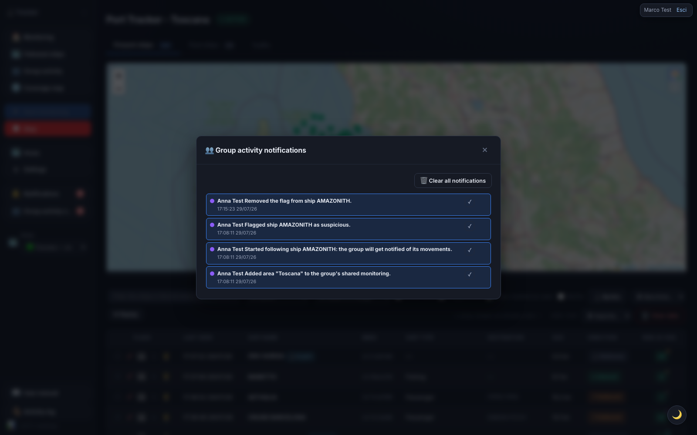

If your account is part of a **group**, the sidebar also shows a **👥 Group activity notifications** button next to "Notifications": same behaviour (unread badge, overlay window, ✓ to mark read, 🗑 to delete with undo), but for a **separate** feed — the actions your group-mates take on areas, followed ships, flags, mutes, seen ships and ship charges (the same ones listed in [Group activity](#group-activity), here only if you've chosen to **be notified** of them). Each row names **who** performed the action, e.g. *"Anna Test started following ship AMAZONITH: the group will get notified of its movements."*

Which actions notify you is decided from the **Notifications** tab in Settings (see below): you choose what **you** receive, but you can't stop your own actions from notifying the other members — the rules are the same for the whole group.

> **Even without a group.** There is one case where this button shows up even if you belong to no group: when another user **edits an area you are monitoring too** (see [Editing an area](#editing-an-area)). The notification lands in this feed and tells you who edited which area, so you immediately know why your monitoring boundaries changed.

---

## Exporting data

All exports are downloaded directly from the browser:

- **CSV** — **⬇ Filtered CSV** in the Current/Past ships toolbar exports the current view (filtered and sorted); **⚙ Settings → Export CSV** instead exports all raw readings.
- **GeoJSON / KML** (for **QGIS** or **Google Earth**) — next to the CSV button you'll find **⬇ GeoJSON** and **⬇ KML**. Four sources: the filtered **ship list** (points), a ship's **track** (from the detail), an area's **replay** (one line per ship), and **berths** (polygons).

---

## Installing the app (PWA)

Tracker Porti is an **installable app** (PWA): you can add it to your phone's home screen or install it on desktop, and it opens full-screen.

- **On phone** — browser → menu → **"Add to Home Screen"** (iPhone/Safari) or **"Install app"** (Android/Chrome).
- **On desktop** — in Chrome/Edge, the install icon in the address bar, or menu → **"Install Tracker Porti"**.

If there's no connection, the app shows an **"You're offline"** screen with a *Retry* button (AIS data is real-time and needs the network). Access stays protected: login is always required.

---

## Frequently asked questions

**The table is empty — what do I do?**
Check that monitoring for the area is started (**● ACTIVE** badge at the top) and that the area has ship traffic. Check the monitored areas from the "Area monitoring" panel in Settings, and the connection from **AIS Diagnostics**.

**How do I avoid losing track of ships I've already checked?**
Use **✓ Seen** on each row: the ship dims, distinguishing it from ones not yet reviewed.

**I changed area and the ships disappeared — is that normal?**
Yes. Each area has independent data and stream. Changing area in the menu is just a view switch: it doesn't start or stop any stream. The previous area's data stays; go back to see it again.

**Can I monitor several areas at once?**
Yes. **⚙ Settings → Area monitoring** and turn on each area's toggle. Then switch between them with the dropdown menu.

**Are military ships always red?**
Yes. They're automatically flagged with maximum score and a red row.

**Can I export the data?**
Yes: CSV, GeoJSON, and KML — see [Exporting data](#exporting-data).
