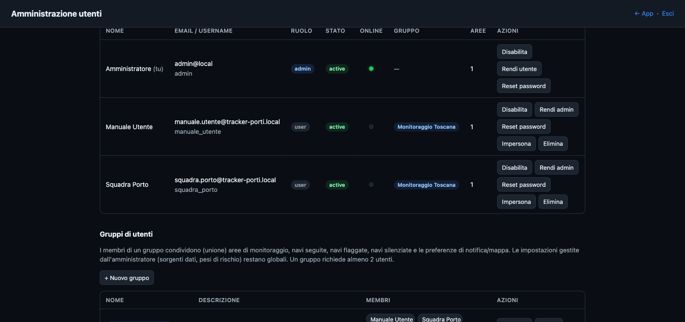
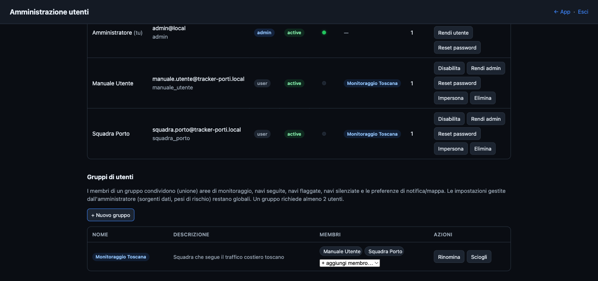
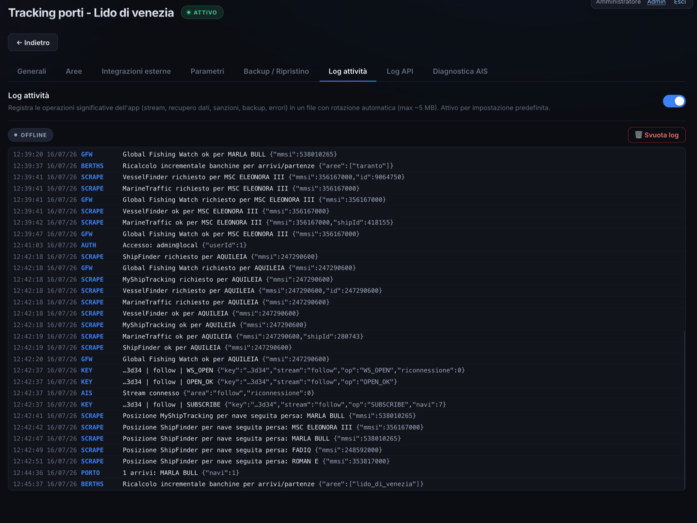
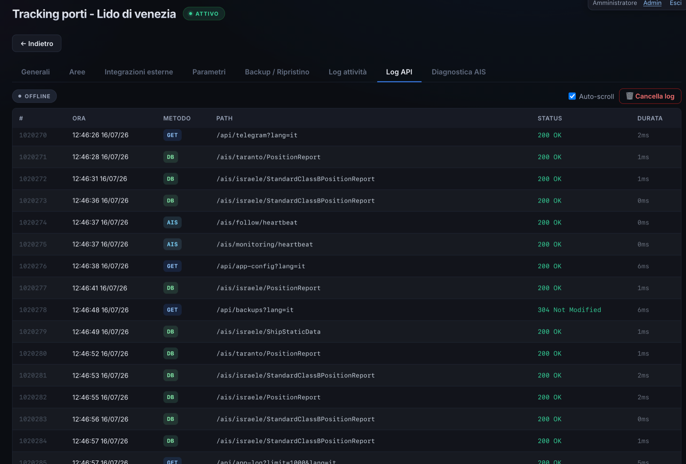
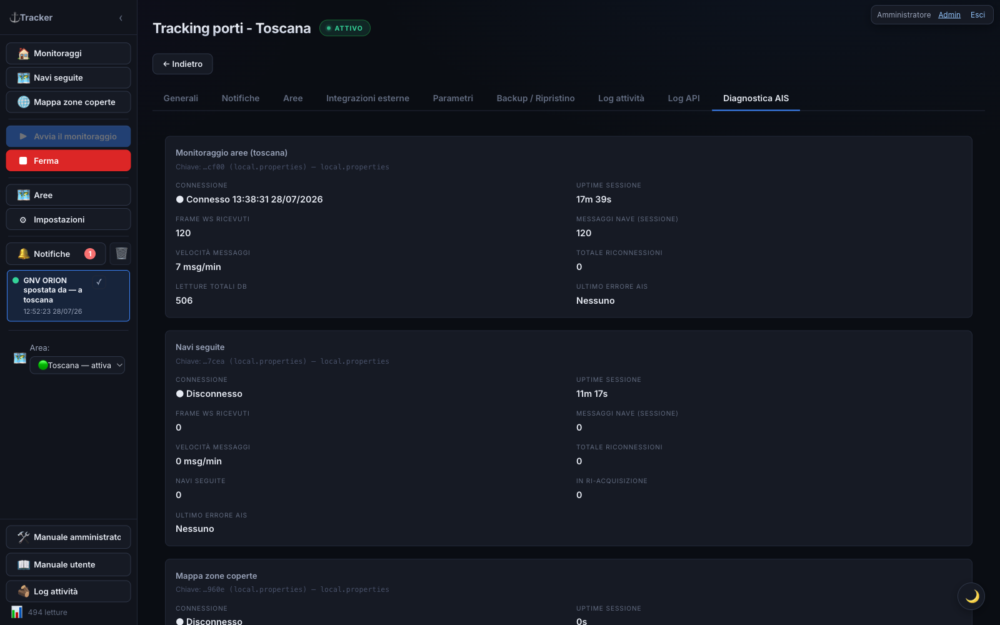
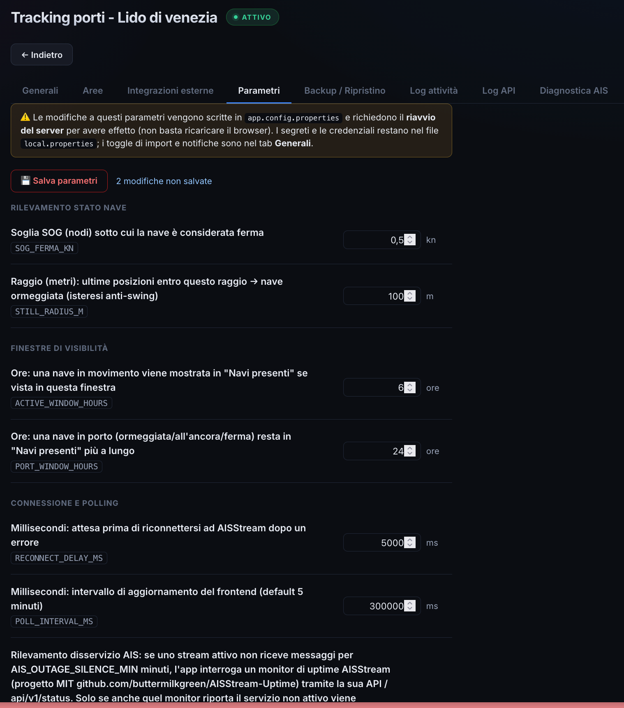
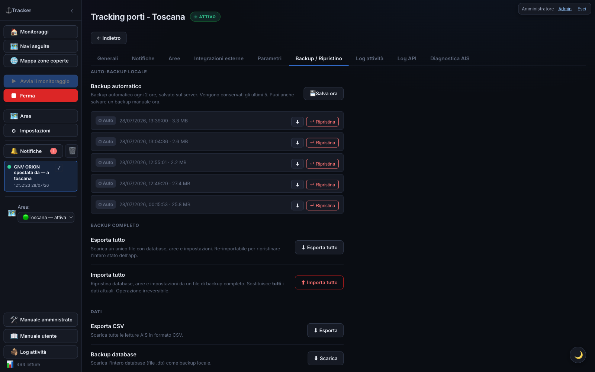

# Manuale Amministratore — Tracker Porti

> 🇬🇧 English version: [manuale_admin.en.md](manuale_admin.en.md) · [index.en.html](index.en.html)

Guida alle funzioni riservate agli **amministratori** di Tracker Porti: gestione utenti e gruppi, controlli della mappa di copertura, modello di rischio, log di sistema e modifica dei file di configurazione.

> Questo manuale **integra** il [Manuale utente](../manuale/index.html), che copre l'uso quotidiano dell'app. Qui trovi **solo** ciò che è riservato agli amministratori. Per le funzioni comuni (monitoraggio, navi seguite, dettaglio nave, notifiche, export…) fai riferimento al manuale utente.

---

## Ruolo amministratore



Gli amministratori vedono in alto a destra il link **Admin**, che apre la **pagina di amministrazione** (`/admin`). Un amministratore può:

- **approvare** le nuove registrazioni in attesa;
- **abilitare o disabilitare** un account;
- **cambiare il ruolo** di un utente (utente normale ↔ amministratore ↔ tester);
- **reimpostare la password** di un utente — genera un **link monouso** (valido 24 ore) da consegnargli;
- **eliminare** un utente;
- **creare e gestire i gruppi di utenti** (vedi sotto);
- **impersonare** un utente — visualizzarne aree, monitoraggi e navi seguite in **sola lettura**, con un banner in evidenza e l'uscita con un click;
- consultare i **log** (log attività e log API), condivisi e visibili solo agli amministratori.

### Le azioni sulla riga utente

Ogni riga della tabella mostra **al massimo un pulsante in evidenza** — quello che quella riga sta aspettando: **Approva** per una registrazione in attesa, **Riabilita** per un account disabilitato. Tutto il resto sta nel menu **···** in fondo alla riga, sempre nello stesso ordine:

1. **stato** — Approva / Approva come tester / Disabilita / Riabilita;
2. **ruolo** — Rendi amministratore, Revoca amministratore oppure **Promuovi a utente** (per un account tester);
3. **utilità** — Reset password, Impersona;
4. **azione distruttiva** — Elimina utente (in rosso, con conferma).

#### Da tester a utente normale

Il ruolo **tester** si assegna solo al momento dell'approvazione, con **Approva come tester**: è un account con limiti ridotti (numero e dimensione delle aree, numero di navi seguite) pensato per le prove.

Quando vuoi togliere quei limiti, apri il menu **···** sulla riga dell'utente e scegli **Promuovi a utente**: l'account diventa un utente normale, senza limiti tester, mantenendo aree, navi seguite e impostazioni già configurate. L'operazione è reversibile solo passando da una nuova approvazione, quindi il ruolo tester non si può riassegnare a un account già promosso.

Le impostazioni gestite dagli amministratori (sorgenti dati, screening sanzioni/PSC, pesi dello score di rischio) sono **globali** per tutti gli utenti. Nell'interfaccia delle Impostazioni, le schede e i toggle riservati agli amministratori sono **nascosti** agli utenti normali (e comunque protetti anche lato server).

---

## Gruppi di utenti



Un amministratore può inserire più utenti in un **gruppo**. Quando un utente fa parte di un gruppo, **condivide con gli altri membri** (come **unione** di ciò che ognuno aveva):

- le **aree** di monitoraggio;
- le **navi seguite**, le **navi segnalate** ★ e le **navi silenziate** 🔕;
- le **preferenze di notifica** (app e Telegram) e di **visualizzazione mappa**, oltre all'**area di default**.

In pratica: se un membro aggiunge un'area, segue una nave o abilita una notifica, **gli altri membri se la ritrovano** al loro prossimo accesso — e viceversa (sincronizzazione *write-through*). Restano invece **personali** di ciascun utente: il **collegamento Telegram** (la propria chat) e la **lingua** dell'interfaccia.

**Gestione (dalla pagina Admin):** un gruppo ha un **nome**, una **descrizione** e **almeno 2 membri**. Alla creazione si sceglie l'**utente modello** da cui prendere le impostazioni iniziali. Si possono **aggiungere/rimuovere** membri o **sciogliere** il gruppo.

> Una rimozione che lascerebbe **1 solo membro** è bloccata: in quel caso si **scioglie** il gruppo. Se un amministratore toglie un utente dal gruppo, quell'utente **mantiene** tutto ciò che nel frattempo era stato condiviso (aree, navi, impostazioni): semplicemente smette di sincronizzarsi con gli altri.

**Log delle azioni di gruppo:** ogni condivisione write-through viene anche registrata (chi, quando, cosa) — i membri la consultano da soli nella sezione [Attività di gruppo](../manuale/index.html#attività-di-gruppo) (visibile a chiunque sia in un gruppo, nessuna azione richiesta dall'amministratore). Le righe più vecchie di `GROUP_ACTIVITY_LOG_RETENTION_DAYS` giorni (default 90, in `app.config.properties`) vengono eliminate automaticamente.

---

## Mappa delle zone coperte — controlli amministratore


La [Mappa delle zone coperte](../manuale/index.html#mappa-delle-zone-coperte) è visibile in sola lettura a tutti gli utenti (e anche senza login su `/heatmap`). Solo gli **amministratori** possono inoltre:

- **avviare** e **fermare** la raccolta dei dati (pulsanti **Avvia/Ferma raccolta**);
- vedere le **statistiche di connessione in tempo reale** (banda usata, messaggi al secondo, celle popolate…);
- **Aggiorna mappa** e **Cancella dati** (svuota la griglia raccolta).

**Come funziona la raccolta:** una volta avviata, gira **in background** sul server — anche se nessuno ha la pagina aperta — finché un amministratore non la ferma. Riprende da sola dopo un riavvio del server. Per sicurezza si **spegne automaticamente** se nessun utente è attivo per **10 minuti**.

> **Attenzione:** mentre la raccolta è attiva l'app **scarica dati da tutto il mondo** in continuazione (circa **200–400 MB l'ora**). La funzione richiede una **chiave AISStream di un account separato** (diverso da quello del monitoraggio normale), impostata in `local.properties` come `HEATMAP_AIS_API_KEY`. Senza quella chiave la funzione resta spenta.

---

## Scoperta porti (per area)

Il sistema individua da sé, in background, quali porti reali ricadono dentro ciascuna area monitorata — utile in vista di funzioni future (oggi è puro dato interno, nessuna schermata ne mostra ancora l'elenco).

**Da ⚙ Impostazioni → Diagnostica AIS** trovi un controllo minimale: scegli un'area dal menu e premi **Cerca porti ora** per rilanciarla a mano. La ricerca parte in background (può richiedere qualche minuto su un'area senza banchine ancora osservate) — il controllo mostra solo un messaggio "Ricerca avviata", senza indicatore di avanzamento né elenco dei porti trovati.

**Come vengono identificati**: se l'area ha già banchine osservate realmente dall'AIS, quelle (raggruppate per vicinanza) **sono** i porti — nessuna fonte esterna interrogata. Altrimenti incrocia World Port Index, UN/LOCODE e VesselFinder (Global Fishing Watch è candidata nel codice ma **non è oggi raggiungibile**, il suo dataset ancoraggi non è disponibile via API); un punto trovato da almeno due fonti indipendenti viene considerato confermato.

**Quando parte la ricerca:**

- **Automaticamente**, alla creazione di una nuova area.
- **In background al riavvio del server**, una tantum, per le aree già esistenti che non hanno ancora porti scoperti (un'area alla volta, con una pausa tra l'una e l'altra, per non appesantire l'avvio).
- **A richiesta**, dal controllo in Diagnostica AIS descritto sopra.

---

## Modello di rischio (pesi dei segnali)

Oltre ai **pesi per tipo di carico** (modificabili da tutti in Impostazioni), gli amministratori possono regolare **quanti punti vale ogni segnale di rischio** (blackout AIS, spoofing/salto di posizione, sosta, aumento pescaggio, sanzioni, PSC, eventi GFW, rendezvous, ecc.) da **⚙ Impostazioni → sezione "⚖ Modello di rischio"**.

- Una **griglia** con un campo per segnale: cambia i valori e premi **💾 Salva pesi**. Effetto **immediato**, senza riavvio. **Ripristina default** riporta i valori di fabbrica.
- Mettere un peso a **0** disattiva quel segnale.
- Puoi salvare configurazioni complete come **profili di rischio** (menu *Profilo di rischio* → *Salva come…*) e richiamarle con *Applica* — utile per passare al volo tra impostazioni diverse (es. un profilo più aggressivo, o uno tarato per aree con copertura AIS scarsa).

> Le **soglie di rilevamento** e i **moltiplicatori** dei segnali non stanno nella UI: restano nel file [`app.config.properties`](#app.config.properties-parametri-di-funzionamento) (chiavi `RISK_*`).

Nella scheda **Generali** delle Impostazioni, sezione "⚖ Modello di rischio", ci sono anche due toggle **riservati agli amministratori** (invisibili agli altri utenti):

- **Escludi tanker** — non assegna il punteggio "tipo nave" agli scafi cisterna (codice AIS 80–89). Utile se monitori il trasporto di armi, che una nave cisterna non può effettuare: azzera solo quel fattore, non l'intero punteggio (una cisterna può restare in fascia rossa per altri segnali — sanzioni, AIS spento, ecc.). È un valore **globale**, condiviso da tutti gli utenti, e diverso dal filtro per tipo nave delle notifiche (Impostazioni → **Notifiche**, personale per ciascun utente): quello decide solo cosa arriva come notifica, senza toccare il punteggio.
- **Controlla salto di posizione** / **Controlla blackout AIS** — includono nel punteggio i relativi segnali. Disattivali nelle aree con copertura AIS scarsa, dove i report radi producono falsi positivi (salti/buchi apparenti non reali).

---

## Log di sistema

I log sono **condivisi** e visibili **solo agli amministratori**, come schede nelle Impostazioni.

### Log attività



Registra le operazioni significative dell'app (stream, recupero dati, sanzioni, backup, errori) in un file con **rotazione automatica** (max ~5 MB). Attivo per impostazione predefinita (toggle **Log attività** nel tab Generali, admin). Il registro è consultabile anche dall'overlay **🪵 Log attività** nella barra laterale e si può **svuotare**.

Il registro riporta anche le notifiche di **cambio area scartate** dai filtri (`Cambio area non notificato: …`) con il motivo: `aree sovrapposte`, `ha solo attraversato`, `sosta troppo vecchia`. È il posto dove guardare quando un utente segnala di non aver ricevuto un avviso che si aspettava — vedi i parametri `AREA_CHANGE_*` in [`app.config.properties`](#app.config.properties-parametri-di-funzionamento).

### Log API



Elenca in tempo reale le chiamate alle API dell'applicazione (metodo, percorso, stato, tempo), utile per la diagnostica. I corpi delle richieste sensibili (login, ecc.) sono **soppressi**: le password non vengono mai registrate.

---

## Diagnostica AIS



La scheda **⚙ Impostazioni → Diagnostica AIS** (visibile solo agli amministratori) mostra lo stato della connessione al flusso dati dell'area attiva, aggiornato ogni 5 s:

- **Connessione** — Connesso / Disconnesso
- **Uptime sessione** — da quanto il flusso è attivo
- **Frame WS ricevuti** / **Messaggi nave** / **Velocità messaggi**
- **Riconnessioni** — quante volte la connessione è stata ripristinata
- **Ultimo errore** — l'eventuale ultimo errore

Il **banner di disservizio AIS** che compare a tutti gli utenti nelle pagine di monitoraggio quando un'area resta a lungo senza segnale è descritto dal punto di vista dell'utente nel [manuale utente](../manuale/index.html#banner-di-disservizio-ais); il meccanismo di conferma esterna che lo alimenta è nella sezione [Crediti](#crediti) qui sotto.

### Modalità fallback

Se il disservizio AIS dura più di **6 ore** (soglia configurabile, `AIS_FALLBACK_HOURS` — vedi [Modifica dei file di configurazione](#modifica-dei-file-di-configurazione)), l'app entra automaticamente in **modalità fallback**: invece di affidarsi solo al feed AIS, riposiziona le navi tramite scraping su **ShipFinder** e **MyShipTracking** (le due sole fonti esterne che forniscono coordinate), per garantire un minimo di monitoraggio anche durante un'interruzione prolungata.

La modalità fallback si avvia sempre nell'ambito più prudente, **"solo navi seguite"**: per ampliarla, o per tornare indietro, usa i due pulsanti in fondo al pannello **⚙ Impostazioni → Diagnostica AIS** (nella stessa scheda descritta sopra, sempre consultabile anche fuori da un disservizio). Mentre la modalità fallback è attiva compare anche una voce dedicata **🔀 Modalità fallback** nel menu laterale (visibile solo agli amministratori), che porta con un clic dritti a questo pannello da qualunque schermata:

- **Stato** — attiva/non attiva, da quando, **durata della sessione corrente**, ambito corrente ("solo navi seguite" o "monitoraggio completo").
- **Storico scraping reale** — un grafico a barre separato per **ShipFinder** e **MyShipTracking** (non più sommati insieme), ultime 48 ore, con barre impilate verde/rosso per richieste riuscite/fallite ed etichette orarie ogni 6 ore — passa il mouse su una barra per il dettaglio esatto.
- **Stima confronto modalità** — due barre che mostrano quante richieste/ora comporterebbe ciascun ambito ("solo navi seguite" vs "monitoraggio completo"), a fianco dello storico reale: prima di allargare l'ambito puoi vedere concretamente di quanto salirebbe il volume di scraping, invece di scegliere alla cieca. Allargare l'ambito **non aumenta** il tetto massimo di richieste/ora (`FALLBACK_MAX_REQ_PER_HOUR`) — lo ridistribuisce solo su più navi, che vengono quindi rivisitate meno spesso.
- **Stato dei "circuit breaker" e problemi della sessione** — se ShipFinder o MyShipTracking mostrano troppi errori 403/429 ravvicinati (possibile segnale di blocco), quella sorgente viene sospesa temporaneamente in automatico; qui vedi se e fino a quando, più un **contatore di quanti sospetti blocco si sono verificati in questa sessione** per ciascuna sorgente — resta visibile anche dopo che il blocco si è auto-risolto, invece di sparire non appena la sorgente riprende a funzionare.

**Log modalità fallback (tempo reale)**: mentre la modalità fallback è attiva, appare anche una seconda voce nel menu laterale, sopra "Log attività" — **🔀 Log modalità fallback**. Apre una finestra flottante (trascinabile, come il Log attività) con due piccoli grafici — uno per ShipFinder, uno per MyShipTracking — che si aggiornano **in tempo reale** ad ogni chiamata effettiva: barre impilate verde/rosso (riuscite/fallite) sugli ultimi 10 minuti, più il totale chiamate/riuscite/fallite di sessione per sorgente. Utile per capire a occhio, mentre la modalità è attiva, quante richieste stiamo facendo davvero e se stanno andando a buon fine — senza aprire le Impostazioni. Finestra desktop, come il Log attività non è pensata per schermi piccoli.

Se una sorgente viene sospesa per sospetto blocco, ricevi un **alert dedicato — solo per gli amministratori** — via notifica in-app, Telegram (attivabile/disattivabile nella scheda Impostazioni → Integrazioni esterne → Telegram, voce "sospetto ban") e un avviso nel banner di disservizio AIS quando sei loggato come admin. La modalità fallback esce da sola quando l'AIS torna stabile per un periodo continuativo (di default 20 minuti), per evitare di attivarsi/disattivarsi ripetutamente su un'interruzione breve.

Un riavvio del server (es. dopo un deploy) a metà di un disservizio non fa perdere lo stato: il banner e l'eventuale modalità fallback già attiva riprendono subito, senza dover attendere di nuovo il periodo di silenzio necessario a riconfermare l'interruzione.

---

## Modifica dei file di configurazione

Alcune impostazioni avanzate non sono nell'interfaccia ma in file di testo nella cartella del progetto. Aprili con un editor di testo, modifica i valori e **riavvia l'applicazione** per applicarli. Le righe che iniziano con `#` (o `//`) sono commenti e vengono ignorate.

### `local.properties` — chiavi e segreti

Contiene la API key e le preferenze iniziali. Formato `CHIAVE=valore`, una per riga. **Non va condiviso** (contiene la API key) ed è in `.gitignore`. Se non esiste, copialo da `local.properties.example`.

| Chiave | Significato |
|---|---|
| `AIS_API_KEY` | Chiave AISStream.io (obbligatoria) — usata dagli stream delle **aree di monitoraggio** |
| `FOLLOW_AIS_API_KEY` | Chiave AISStream.io per lo stream delle **navi seguite**. Meglio da un **account separato** (vedi nota). Vuota = riusa `AIS_API_KEY` |
| `HEATMAP_AIS_API_KEY` | Chiave di un account AISStream **separato**, usata **solo** per la Mappa delle zone coperte. Vuota = funzione disattivata. Va scritta "nuda", **senza commenti sulla stessa riga** |
| `BBOX_PRESET` | Area mostrata all'avvio (chiave di un'area, es. `bari`) |
| `IMPORT_VF_DATA` / `IMPORT_MT_DATA` | `true`/`false` — abilitano l'import VesselFinder / MarineTraffic |
| `IMPORT_SF_DATA` | `true`/`false` — import ShipFinder + posizione per ri-localizzare le navi seguite perse |
| `IMPORT_MST_DATA` | `true`/`false` — import MyShipTracking (seconda fonte di posizione di backup) |
| `IMPORT_SANCTIONS` | `true`/`false` — screening contro la lista OFAC SDN |
| `IMPORT_SANCTIONS_EXTRA` | `true`/`false` — liste UE / UK OFSI / ONU (solo con `IMPORT_SANCTIONS`); default `true` |
| `IMPORT_PSC` | `true`/`false` — screening Port State Control (bandiere Paris/Tokyo MoU + navi bandite) |
| `IMPORT_EQUASIS` | `true`/`false` — lookup Equasis on-demand nel dettaglio nave |
| `EQUASIS_USER` / `EQUASIS_PASSWORD` | Credenziali dell'account Equasis (registrazione gratuita su equasis.org) |
| `IMPORT_GFW` | `true`/`false` — arricchimento Global Fishing Watch; **default `true`** |
| `GLOBAL_FISHING_WATCH_TOKEN` | Token API (Bearer) di Global Fishing Watch. Dati gratuiti solo per uso non commerciale |
| `ADMIN_USERNAME` / `ADMIN_EMAIL` / `ADMIN_PASSWORD` | Amministratore predefinito (creato all'avvio se manca). **`ADMIN_PASSWORD` è obbligatoria**: se non è configurata e non esiste già nessun admin, l'avvio si interrompe con un errore invece di creare un account con password debole. **Cambia la password** su un server raggiungibile da altri |
| `COOKIE_SECURE` | `true`/`false` — invia il cookie di sessione solo su HTTPS; impostare a `true` dietro TLS |
| `SESSION_TTL_DAYS` | Durata in giorni della sessione di login. Default `30` |

> **💡 Consigliato: tre chiavi da tre account AISStream separati.** AISStream limita le connessioni **per account, non per chiave**. L'app apre tre stream indipendenti — **monitoraggio aree** (`AIS_API_KEY`), **navi seguite** (`FOLLOW_AIS_API_KEY`) e **mappa di copertura** (`HEATMAP_AIS_API_KEY`). Se due usano chiavi dello **stesso account**, competono per lo stesso slot e uno viene continuamente rifiutato. Dai a ciascuna funzione una chiave di un **account dedicato**.

### `app.config.properties` — parametri di funzionamento



Contiene soglie e parametri (finestre temporali, raggi, retention, banchine, pesi dello score). Formato `CHIAVE=valore`, ogni parametro documentato da un commento nel file. **Puoi modificarli anche dall'interfaccia** in **⚙ Impostazioni → Parametri** (più comodo). In entrambi i casi serve **riavviare il server** per applicarli (vengono letti solo all'avvio). Esempi:

| Chiave | Significato | Default |
|---|---|---|
| `SOG_FERMA_KN` | Velocità (nodi) sotto cui una nave è "ferma" | `0.5` |
| `ACTIVE_WINDOW_HOURS` | Ore entro cui una nave in movimento resta tra le "presenti" | `6` |
| `PORT_WINDOW_HOURS` | Ore di permanenza tra le "presenti" per una nave in porto | `24` |
| `POLL_INTERVAL_MS` | Intervallo di aggiornamento dell'interfaccia (ms) | `300000` |
| `AIS_OUTAGE_CHECK` | Attiva il rilevamento dei disservizi AIS | `true` |
| `AIS_OUTAGE_SILENCE_MIN` | Minuti senza segnali prima di interrogare il monitor di uptime | `10` |
| `AIS_UPTIME_SELFHOST_URL` | URL di una tua istanza self-hosted del monitor (interrogata per prima) | _(vuoto)_ |
| `AIS_UPTIME_URL` | URL del monitor di uptime pubblico, usato come ripiego | `https://aisuptime.buttermilkgreen.fyi` |
| `AIS_FALLBACK_HOURS` | Ore di disservizio AIS prima di entrare in [modalità fallback](#diagnostica-ais) | `6` |
| `AIS_FALLBACK_EXIT_GRACE_MIN` | Minuti di servizio stabile prima di uscire dalla modalità fallback | `20` |
| `FALLBACK_MAX_REQ_PER_HOUR` | Tetto massimo di richieste/ora (ShipFinder+MyShipTracking insieme) in modalità fallback | `90` |
| `FALLBACK_CIRCUIT_TRIP_COUNT` | Fallimenti 403/429 (su navi distinte) che sospendono una sorgente | `5` |
| `FALLBACK_CIRCUIT_TRIP_WINDOW_MIN` | Finestra temporale entro cui contare quei fallimenti | `10` |
| `FALLBACK_CIRCUIT_COOLDOWN_MIN` | Minuti di sospensione di una sorgente dopo un sospetto blocco | `30` |
| `MAX_READINGS_PER_TYPE` | Numero massimo di letture conservate per tipo di messaggio | `10000` |
| `BERTH_CLUSTER_EPS_M` | Raggio di clustering attracchi → banchine (metri) | `80` |
| `BERTH_MIN_PTS` | Attracchi minimi vicini per formare una banchina | `3` |
| `BERTH_MIN_MOORINGS` | Attracchi minimi prima di caratterizzare una banchina | `10` |
| `BERTH_DOMINANT_PCT` | Percentuale che una categoria deve superare per dare il nome alla banchina | `60` |
| `BERTH_RECOMPUTE_MIN` | Minuti tra un ricalcolo automatico delle banchine e il successivo | `30` |
| `HEATMAP_GRID_DEG` | Dimensione delle celle della mappa di copertura, in gradi (~28 km) | `0.25` |
| `HEATMAP_FLUSH_SEC` | Ogni quanti secondi i conteggi vengono scritti su disco | `10` |
| `GROUP_ACTIVITY_LOG_RETENTION_DAYS` | Giorni di retention del log delle azioni di gruppo (vedi sopra) | `90` |
| `TRANSIT_STOP_MIN_H` | Ore di permanenza minime perché una visita in area conti come **sosta** e non come semplice attraversamento (ricerca per aree di transito e notifica cambio area) | `3` |
| `TRANSIT_STOP_MAX_SOG_KN` | Velocità minima osservata sotto cui la nave è considerata davvero ferma (solo per le visite recenti, con posizioni ancora in archivio) | `0.5` |
| `TRANSIT_MIN_KN` | Velocità media minima implicita di una traversata diretta fra due aree: sotto questa, il tempo trascorso è considerato troppo lungo | `4` |
| `TRANSIT_MIN_SLACK_H` | Soglia minima del limite temporale, per non penalizzare le aree vicine | `12` |
| `TRANSIT_MAX_GAP_DAYS` | Tetto massimo del limite temporale, qualunque sia la distanza | `30` |
| `TRANSIT_MAX_ROWS` | Numero massimo di navi restituite da una ricerca per aree di transito | `500` |
| `AREA_CHANGE_REQUIRE_STOP` | Notifica cambio area solo se la nave ha **sostato** nell'area di partenza | `true` |
| `AREA_CHANGE_REQUIRE_PLAUSIBLE_TIME` | Notifica cambio area solo se lo scalo di partenza è abbastanza recente da spiegare l'arrivo | `true` |
| `AREA_CHANGE_SKIP_OVERLAPPING` | Nessuna notifica cambio area fra due aree le cui bbox si sovrappongono | `true` |
| `RISK_*` | Pesi e soglie dello score di rischio (vedi commenti nel file) | vari |

### `bounding-boxes.json` — definizione delle aree

Elenca le aree di monitoraggio. **Il modo consigliato per gestirle è la schermata 🗺 Aree** (che riscrive questo file da sola). Puoi modificarlo a mano per il provisioning iniziale; in tal caso **riavvia** l'app.

Ogni area:

```json
"bari": { "name": "Porto di Bari", "keyword": "BARI", "sw": [40.95, 16.60], "ne": [41.30, 17.10] }
```

| Campo | Significato |
|---|---|
| chiave (`bari`) | Identificatore interno dell'area (usato anche da `BBOX_PRESET`) |
| `name` | Nome mostrato nell'interfaccia |
| `keyword` | (Facoltativa, può essere `null`) filtra le "Navi attese" per destinazione |
| `sw` | Angolo Sud-Ovest `[lat, lon]` in gradi decimali |
| `ne` | Angolo Nord-Est `[lat, lon]` in gradi decimali |

> Modifiche fatte a mano a questo file mentre l'app è in esecuzione si applicano solo dopo un riavvio. Se usi la schermata Aree, la formattazione del file viene normalizzata (resta valido, ma cambia l'indentazione).

---

## Backup, ripristino e deploy



Da **⚙ Impostazioni → Backup** (visibile solo agli amministratori) **scarichi un backup** del database, **ripristini** un backup salvato ed **esporti** i dati.

- Il **ripristino** di un database sostituisce **tutti** i dati attuali (irreversibile): scarica un backup prima. Dopo il ripristino i dati vengono riassegnati all'area corretta in base alle coordinate. Il ripristino **non** rilancia lo scraping VesselFinder/MarineTraffic (i dati sono già nel DB ripristinato).
- I dati della **Mappa delle zone coperte** stanno in un **database separato**, esportabile/importabile a parte e comunque incluso nel backup completo.
- **Auto-ripristino dopo un deploy:** il database viene cancellato quando si aggiorna l'applicazione. Se all'avvio il DB **non esiste** e sono presenti degli **auto-backup** (cartella `data/backups/`), l'app ripristina automaticamente l'ultimo backup. Richiede che la cartella dei backup sopravviva al deploy. Non scatta se il DB esiste ma è stato solo svuotato con "Cancella dati". Disattivabile con `AUTO_RESTORE_ON_DEPLOY=false` in `app.config.properties`.

---

## Crediti

Il rilevamento dei disservizi AIS (il banner di disservizio) si appoggia al progetto **[AISStream-Uptime](https://github.com/buttermilkgreen/AISStream-Uptime)** di buttermilkgreen, un monitor di uptime per il servizio AISStream. L'app non ne incorpora il codice: consulta soltanto la API pubblica della sua istanza ospitata (`https://aisuptime.buttermilkgreen.fyi`) per capire se l'eventuale silenzio dei dati dipende da un guasto del servizio o semplicemente da un'area poco trafficata. Il progetto è open source (licenza MIT) e puoi **ospitarlo tu stesso**: indica l'URL della tua istanza in `AIS_UPTIME_SELFHOST_URL`.
